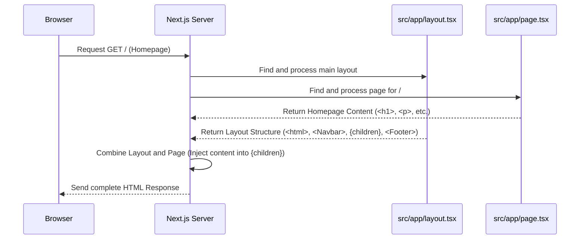

# Chapter 1: Next.js Application Structure

Welcome to the Hevy Gym Trainer App tutorial! We're going to build a cool application that uses AI to help you get fit. But before we dive into the fancy AI stuff, we need to understand how the basic structure of our application works.

Imagine you're building a house. You wouldn't just start throwing up walls randomly, right? You'd need a plan, a blueprint, to decide where the rooms go, how you move between them (hallways), and what the overall house looks like.

In web development, especially for the part users see (the frontend), we also need a plan. That's where **Next.js** comes in for our project. Next.js is a powerful tool (a framework) that gives us a smart way to organize our code, define different pages (like rooms in a house), handle navigation (like hallways), and manage the overall look and feel.

**Our Goal:** Let's start with a simple goal: understand how the main **Homepage** of the Hevy Gym Trainer app is displayed when you visit the website. How does Next.js know what to show you?

## Key Concepts: Building Blocks of Our App

Next.js uses a few core ideas to keep things organized, especially within the `src/app` directory, which is the heart of our user interface.

1.  **The `app` Directory:** Think of the `src/app` folder as the main blueprint folder for our website's user-facing part. Almost everything the user sees originates from here.

2.  **Pages (`page.tsx`):** Inside the `app` directory, any file named `page.tsx` represents the main content for a specific web address (URL).
    *   For our homepage (like `http://localhost:3000/`), the content comes from the file `src/app/page.tsx`.
    *   If we had a profile page at `/profile`, its content would likely come from `src/app/profile/page.tsx`.

3.  **Layouts (`layout.tsx`):** Often, different pages share common elements like a header (navbar) at the top and a footer at the bottom. A file named `layout.tsx` defines this shared structure. Pages are then placed *inside* this layout. Our main layout is defined in `src/app/layout.tsx`.

4.  **Routing (Moving Between Pages):** How does Next.js know which `page.tsx` to show? It cleverly uses the folder structure inside `app`.
    *   The `app` directory itself represents the root (`/`) of the website. So, `app/page.tsx` is the homepage.
    *   A folder named `profile` inside `app` (`app/profile/`) would correspond to the `/profile` URL path. The file `app/profile/page.tsx` would define the content for that page.

5.  **Components:** Websites are built from smaller, reusable pieces like buttons, images, or text blocks. These are called components. Our `layout.tsx` uses components like `<Navbar />` and `<Footer />`. We'll explore components more in [Chapter 3: UI Component System (Shadcn UI & Tailwind)](03_ui_component_system__shadcn_ui___tailwind__.md).

## How the Homepage is Displayed

Let's revisit our goal: showing the homepage. When you open `http://localhost:3000` in your browser:

1.  Next.js sees you're asking for the root path (`/`).
2.  It looks inside the `src/app` directory.
3.  It finds two important files for this route:
    *   `src/app/layout.tsx`: This defines the overall structure (like the Navbar and Footer).
    *   `src/app/page.tsx`: This defines the specific content for the homepage.
4.  Next.js takes the content from `page.tsx` and inserts it into the `layout.tsx` where a special placeholder `{children}` is located.
5.  The final combined HTML is sent to your browser.

Let's look at simplified versions of these files:

**`src/app/layout.tsx` (Simplified)**

```typescript
import Navbar from "@/components/Navbar"; // Import the Navbar component
import Footer from "@/components/Footer"; // Import the Footer component
import "./globals.css"; // Import global styles

// This function defines the main structure
export default function RootLayout({
  children, // This 'children' prop is where page content will go
}: {
  children: React.ReactNode;
}) {
  return (
    <html lang="en">
      <body>
        <Navbar /> {/* Display the Navbar at the top */}

        {/* Main content area where the page content is inserted */}
        <main>{children}</main>

        <Footer /> {/* Display the Footer at the bottom */}
      </body>
    </html>
  );
}
```

*   **Explanation:** This file sets up the basic HTML structure (`<html>`, `<body>`). It includes the `<Navbar />` and `<Footer />` components, which will appear on *all* pages using this layout. The crucial part is `{children}` – that's the placeholder where the content from `page.tsx` (or other pages) will be injected.

**`src/app/page.tsx` (Simplified)**

```typescript
import { Button } from "@/components/ui/button"; // Import a Button component
import Link from "next/link"; // Import Link for navigation

// This function defines the homepage content
const HomePage = () => {
  return (
    <div>
      {/* The main heading */}
      <h1>
        Transform Your Body With Advanced AI Technology
      </h1>

      {/* Some descriptive text */}
      <p>
        Talk to our AI assistant and get personalized diet plans...
      </p>

      {/* A button linking to another page */}
      <Button asChild>
        <Link href={"/generate-program"}>
          Build Your Program
        </Link>
      </Button>

      {/* ... more homepage content ... */}
    </div>
  );
};
export default HomePage;
```

*   **Explanation:** This file defines what's unique to the homepage – the main welcome message, introductory text, and the "Build Your Program" button. This entire block of content gets placed where `{children}` was in the `layout.tsx`.

## Under the Hood: What Next.js Does

When your browser asks for the homepage, here's a simplified step-by-step:

1.  **Request:** Your browser sends a request for the `/` path to the Next.js development server (usually running on `localhost:3000`).
2.  **Routing:** The Next.js server recognizes the `/` path.
3.  **File Lookup:** It looks inside the `src/app` folder and finds the relevant files: `layout.tsx` and `page.tsx`.
4.  **Rendering:** Next.js processes `layout.tsx` to build the outer structure (HTML, body, Navbar, Footer). It then processes `page.tsx` to generate the homepage content.
5.  **Combining:** It takes the generated homepage content and injects it into the `{children}` placeholder within the layout structure.
6.  **Response:** The server sends the complete HTML page back to your browser, which then displays it.

Here's a diagram illustrating this flow:



**Other Important Files:**

*   **`next.config.ts`:** This file holds configuration settings for Next.js itself. We usually don't need to touch it often at the beginning.
    ```typescript
    // next.config.ts
    import type { NextConfig } from "next";

    const nextConfig: NextConfig = {
      /* config options can go here if needed */
    };

    export default nextConfig;
    ```
    *   **Explanation:** This is the main configuration file for our Next.js project. For now, it's quite simple.

*   **`src/middleware.ts`:** This special file allows us to run code *before* a request is fully processed. In our app, it's used to check if a user needs to be logged in to access certain pages (like `/generate-program` or `/profile`). We'll learn more about user login in [Chapter 2: Clerk User Management](02_clerk_user_management_.md).
    ```typescript
    // src/middleware.ts (Simplified Concept)
    import { clerkMiddleware, createRouteMatcher } from "@clerk/nextjs/server";

    // Define which routes need login
    const isProtectedRoute = createRouteMatcher(["/generate-program", "/profile"]);

    // The main middleware function
    export default clerkMiddleware((auth, req) => {
      // If the requested route is protected, check if user is logged in
      if (isProtectedRoute(req)) {
        auth.protect(); // This function (from Clerk) handles the login check
      }
    });

    // Configuration for the middleware
    export const config = {
      matcher: [ /* Patterns for routes this middleware applies to */ ],
    };
    ```
    *   **Explanation:** This code checks if the URL path requested by the user matches `/generate-program` or `/profile`. If it does, it uses `auth.protect()` (part of the Clerk library we'll discuss next) to ensure the user is signed in. If not, the user might be redirected to a login page.

## Conclusion

Congratulations! You've just taken your first step into understanding the Hevy Gym Trainer App's structure. We learned that Next.js uses the `app` directory with `page.tsx` files for page content and `layout.tsx` files for shared UI elements like headers and footers. This file-based routing makes organizing our application clean and intuitive. We saw how the homepage is built by combining the main layout with the specific content from `src/app/page.tsx`.

Now that we have a basic structure, how do we handle users signing up and logging in? That's exactly what we'll cover in the next chapter!

**Next Up:** [Chapter 2: Clerk User Management](02_clerk_user_management_.md)

---

Generated by [AI Codebase Knowledge Builder](https://github.com/The-Pocket/Tutorial-Codebase-Knowledge)