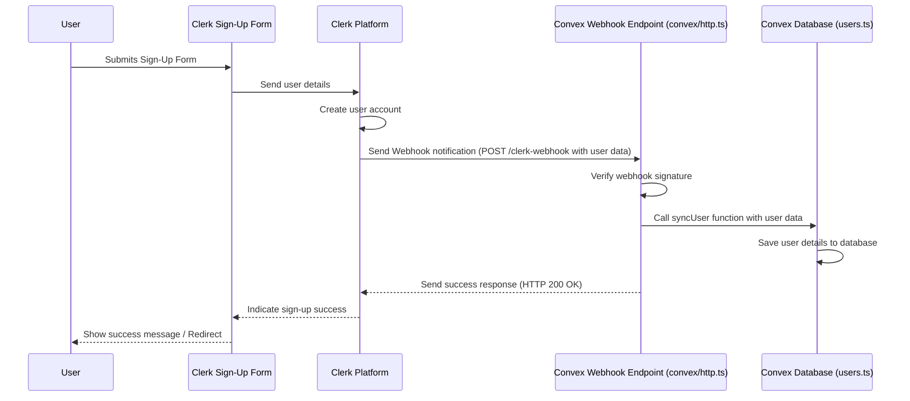

# Chapter 2: Clerk User Management

In [Chapter 1: Next.js Application Structure](01_next_js_application_structure_.md), we saw how our app's basic pages are laid out using Next.js. But most apps, including our Hevy Gym Trainer, need a way to know *who* is using them. We need users to be able to sign up, log in, and have their own personal space (like saving their fitness plans). How do we handle all this securely?

**Our Goal:** Understand how users can create accounts and log into the Hevy Gym Trainer app, and how the app keeps track of logged-in users.

## What Problem Does This Solve?

Imagine our gym app without user accounts. Anyone could see anyone else's fitness plan! That's not very private or personalized. We need a system to:

1.  Let new users **sign up** (create an account).
2.  Let existing users **log in** (prove who they are).
3.  **Protect** certain parts of the app so only logged-in users can access them (like their personal profile page).
4.  Keep track of user information (like name and email) securely.

Building all of this from scratch is complex and requires careful security handling. That's where **Clerk** comes in.

## Meet Clerk: Our App's Security Guard & Receptionist

Think of **Clerk** as a dedicated service that handles all the tricky parts of user management for us. It's like hiring a professional security company for our app.

*   **Receptionist (Sign Up/Log In):** Clerk provides ready-made, secure forms for users to sign up and log in. We don't have to build these complex forms ourselves.
*   **Security Guard (Authentication & Authorization):** Clerk verifies users when they log in (authentication – checking their ID) and helps us control which pages logged-in users can access (authorization – checking their access pass).
*   **Record Keeper (User Data Sync):** When a user signs up or updates their profile via Clerk, Clerk automatically notifies our app's backend ([Chapter 4: Convex Backend & Data](04_convex_backend___data_.md)) so our database stays up-to-date.

## Key Concepts

1.  **Authentication (Who are you?):** This is the process of verifying a user's identity, usually with an email/password or social logins (like Google). Clerk handles this securely.
2.  **Authorization (What can you access?):** Once logged in, what parts of the app can the user see? We use Clerk to protect specific routes (pages) so only authenticated users can view them.
3.  **Clerk Components:** Clerk provides pre-built pieces (React components) like `<SignIn />` and `<SignUp />` that we can easily drop into our Next.js pages.
4.  **Middleware:** This is a special piece of code (in `src/middleware.ts`) that runs *before* a page is loaded. We use it with Clerk to check if a user needs to be logged in to access the requested page. If they aren't logged in, Clerk can redirect them to the login page.
5.  **Webhooks (Keeping Sync):** This is a mechanism for Clerk to automatically send a message (a "webhook") to our backend (Convex) whenever something important happens, like a new user signing up or updating their profile. This ensures our app's database has the latest user information.

## How Clerk Works in Our App

Let's see how these concepts come together.

**1. Signing Up & Logging In:**

When a user wants to sign up or log in, they navigate to specific pages in our app. These pages use Clerk's pre-built components.

**`src/app/(auth)/sign-up/[[...sign-up]]/page.tsx` (Simplified)**

```typescript
import { SignUp } from "@clerk/nextjs"; // Import the SignUp component from Clerk
import React from "react";

const SignUpPage = () => {
  return (
    // Center the sign-up form on the page
    <main className="flex h-screen w-full items-center justify-center">
      {/* This component renders Clerk's sign-up form */}
      <SignUp />
    </main>
  );
};

export default SignUpPage;
```

*   **Explanation:** This file defines the page for the `/sign-up` route. It simply imports and displays Clerk's `<SignUp />` component, which handles the entire sign-up process (collecting email/password, verification, etc.).

**`src/app/(auth)/sign-in/[[...sign-in]]/page.tsx` (Simplified)**

```typescript
import { SignIn } from "@clerk/nextjs"; // Import the SignIn component from Clerk
import React from "react";

const SignInPage = () => {
  return (
    // Center the sign-in form on the page
    <main className="flex h-screen w-full items-center justify-center">
      {/* This component renders Clerk's sign-in form */}
      <SignIn />
    </main>
  );
};

export default SignInPage;
```

*   **Explanation:** Similar to the sign-up page, this file uses Clerk's `<SignIn />` component to provide a ready-made, secure login form on the `/sign-in` route.

**2. Protecting Pages (Middleware):**

How do we prevent someone who isn't logged in from accessing, say, the `/profile` page? We use middleware.

**`src/middleware.ts` (Simplified)**

```typescript
import { clerkMiddleware, createRouteMatcher } from "@clerk/nextjs/server";

// Define which pages/routes require the user to be logged in
const isProtectedRoute = createRouteMatcher([
  "/generate-program", // The plan generation page
  "/profile",        // The user's profile page
]);

// This function runs before loading protected pages
export default clerkMiddleware(async (auth, req) => {
  // Check if the requested page (req.url) is one we defined as protected
  if (isProtectedRoute(req)) {
    // If it's protected, use Clerk's function to ensure the user is logged in.
    // If not logged in, Clerk redirects them to the sign-in page.
    await auth.protect();
  }
});

// Configuration telling Next.js which paths this middleware applies to
export const config = {
  matcher: [ /* ... patterns covering app routes ... */ ],
};
```

*   **Explanation:** This file sets up a check. Before loading `/generate-program` or `/profile`, it uses `clerkMiddleware`. Inside, `isProtectedRoute` checks if the requested URL matches our list. If it does, `auth.protect()` takes over. If the user *is* logged in, they proceed to the page. If *not*, Clerk automatically redirects them to the sign-in page defined in our Clerk settings.

**3. Connecting Clerk to the App (Provider):**

To make Clerk available throughout our Next.js application and connect it with our Convex backend, we wrap our entire app in special providers.

**`src/providers/ConvexClerkProvider.tsx` (Simplified)**

```typescript
"use client";

import { ClerkProvider, useAuth } from "@clerk/nextjs";
import { ConvexReactClient } from "convex/react";
import { ConvexProviderWithClerk } from "convex/react-clerk";
import { ReactElement } from "react";

// Initialize the Convex client (connection to our backend)
const convex = new ConvexReactClient(process.env.NEXT_PUBLIC_CONVEX_URL!);

function ConvexClerkProvider({ children }: { children: ReactElement }) {
  return (
    // 1. ClerkProvider makes Clerk functions available (like checking login status)
    <ClerkProvider /* ... Clerk config ... */ >
      {/* 2. ConvexProviderWithClerk links Clerk authentication to Convex */}
      <ConvexProviderWithClerk client={convex} useAuth={useAuth}>
        {/* 'children' represents the rest of our application */}
        {children}
      </ConvexProviderWithClerk>
    </ClerkProvider>
  );
}

export default ConvexClerkProvider;
```

*   **Explanation:** This component wraps our entire application (as seen in `src/app/layout.tsx`).
    *   `<ClerkProvider>` initializes Clerk for the frontend.
    *   `<ConvexProviderWithClerk>` connects Clerk's user authentication information to our [Chapter 4: Convex Backend & Data](04_convex_backend___data_.md), allowing secure backend operations.

## Under the Hood: Keeping User Data Synced with Webhooks

When a user signs up using the Clerk `<SignUp />` component, Clerk creates the user account on *its* servers. But how does *our* app's database (in Convex) know about this new user? Clerk uses **Webhooks**.

Think of a webhook like an automated notification system.

**Step-by-Step User Sync:**

1.  **User Signs Up:** A user fills out the sign-up form (provided by Clerk) in our app.
2.  **Clerk Creates User:** Clerk securely creates the user account on its own platform.
3.  **Clerk Sends Webhook:** Clerk automatically sends an HTTP POST request (the "webhook") to a specific URL endpoint we've configured in our Convex backend. This request contains information about the newly created user (like their Clerk ID, email, name).
4.  **Convex Receives Webhook:** Our Convex backend listens for requests at that specific URL (`/clerk-webhook` defined in `convex/http.ts`).
5.  **Convex Verifies Webhook:** Convex verifies that the request genuinely came from Clerk using a secret key (to prevent fake notifications).
6.  **Convex Saves User Data:** If verified, Convex extracts the user data from the webhook payload and calls a function (`syncUser` in `convex/users.ts`) to save this user information into our `users` database table.

Here's a diagram showing this flow:



**Code Snippets for Synchronization:**

**`convex/http.ts` (Simplified Webhook Handler)**

```typescript
import { httpRouter } from "convex/server";
import { WebhookEvent } from "@clerk/nextjs/server";
import { Webhook } from "svix"; // Library to verify webhooks
import { api } from "./_generated/api"; // To call our database functions
import { httpAction } from "./_generated/server";

const http = httpRouter();

// Define the route that listens for Clerk webhooks
http.route({
  path: "/clerk-webhook",
  method: "POST",
  handler: httpAction(async (ctx, request) => {
    // 1. Verify the webhook signature (ensure it's really from Clerk)
    const webhookSecret = process.env.CLERK_WEBHOOK_SECRET!;
    const wh = new Webhook(webhookSecret);
    let evt: WebhookEvent;
    try {
      // Verify using headers and payload from the request
      evt = wh.verify(await request.text(), /* ... headers ... */) as WebhookEvent;
    } catch (err) {
      console.error("Error verifying webhook:", err);
      return new Response("Error occurred", { status: 400 });
    }

    // 2. Check the type of event (e.g., user created, user updated)
    const eventType = evt.type;

    // 3. If a new user was created...
    if (eventType === "user.created") {
      const { id, email_addresses, first_name, image_url } = evt.data;
      const email = email_addresses[0].email_address;

      // 4. Call our database mutation to save the user
      await ctx.runMutation(api.users.syncUser, {
        clerkId: id, // Store Clerk's user ID
        email: email,
        name: first_name || "", // Handle potentially missing names
        image: image_url,
      });
    }

    // (Similar logic for eventType === "user.updated")

    return new Response("Webhook processed", { status: 200 });
  }),
});

export default http;
```

*   **Explanation:** This file sets up an HTTP endpoint `/clerk-webhook`. When Clerk sends a POST request here, this code verifies it's authentic using a secret key. If it's a `user.created` event, it extracts the user details and calls the `syncUser` mutation (defined below) to save them in the Convex database.

**`convex/users.ts` (Simplified User Sync Mutation)**

```typescript
import { mutation } from "./_generated/server";
import { v } from "convex/values"; // For defining argument types

// Function to save a new user received from Clerk webhook
export const syncUser = mutation({
  // Define expected arguments and their types
  args: {
    clerkId: v.string(),
    email: v.string(),
    name: v.string(),
    image: v.optional(v.string()), // Image URL is optional
  },
  // The actual code to run
  handler: async (ctx, args) => {
    // Check if a user with this Clerk ID already exists in our DB
    const existingUser = await ctx.db
      .query("users")
      .filter((q) => q.eq(q.field("clerkId"), args.clerkId))
      .first();

    // If user already exists, do nothing (idempotent)
    if (existingUser) {
      console.log(`User with Clerk ID ${args.clerkId} already exists.`);
      return;
    }

    // If user doesn't exist, insert their details into the 'users' table
    console.log(`Creating new user with Clerk ID ${args.clerkId}.`);
    await ctx.db.insert("users", {
      clerkId: args.clerkId,
      email: args.email,
      name: args.name,
      image: args.image,
      // Add any other default fields for a new user if needed
    });
  },
});

// (A similar 'updateUser' mutation handles "user.updated" webhooks)
```

*   **Explanation:** This file defines a `syncUser` function (a "mutation" because it changes data) that can be called from our webhook handler. It takes the user details (Clerk ID, email, name, image) as arguments. It first checks if we already have a user with that `clerkId` in our database. If not, it inserts a new record into the `users` table. This prevents duplicate users if Clerk sends the same webhook multiple times for some reason.

## Conclusion

We've learned how Clerk acts as our app's combined security guard and receptionist, handling the complex tasks of user sign-up, login, and session management. We saw how Clerk's pre-built components (`<SignIn />`, `<SignUp />`) make it easy to add authentication flows to our Next.js frontend. We also explored how middleware (`src/middleware.ts`) protects specific routes, ensuring only logged-in users can access them. Finally, we uncovered how Clerk uses webhooks to automatically notify our Convex backend (`convex/http.ts`, `convex/users.ts`) whenever user data changes, keeping our application's database synchronized.

With user management handled, we can now focus on making the app look good! How do we build the user interface elements like buttons, cards, and layouts?

**Next Up:** [Chapter 3: UI Component System (Shadcn UI & Tailwind)](03_ui_component_system__shadcn_ui___tailwind__.md)

---

Generated by [AI Codebase Knowledge Builder](https://github.com/The-Pocket/Tutorial-Codebase-Knowledge)