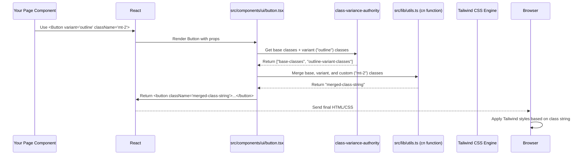

# Chapter 3: UI Component System (Shadcn UI & Tailwind)

Welcome back! In [Chapter 2: Clerk User Management](02_clerk_user_management_.md), we learned how our app handles user logins and keeps track of who's using it. Now that users can log in, we need to actually build the screens they interact with – the profile page, the program generation form, and so on. How do we make these pages look good and consistent without writing tons of repetitive styling code?

**Our Goal:** Understand how the visual elements (like buttons, cards, menus) of the Hevy Gym Trainer app are built and styled efficiently using Shadcn UI and Tailwind CSS.

## What Problem Does This Solve?

Imagine building a user interface (UI) from scratch every time. You'd need to decide exactly how every button looks, how every card is structured, how much padding goes where. This is slow, leads to inconsistencies (buttons might look slightly different on different pages), and makes changes difficult.

We need a system – like a set of pre-designed building blocks and a clear style guide – to build our UI quickly and consistently.

**Use Case Example:** How do we easily create a standard-looking, clickable button like the "Sign Up" button we saw in the `Navbar`?

## Meet Our Building Blocks: Shadcn UI & Tailwind CSS

Think of building our app's interface like constructing something with Lego:

1.  **Shadcn UI:** This is like having a box of pre-designed, high-quality Lego bricks. It provides ready-to-use code for common UI elements like buttons (`<Button />`), cards (`<Card />`), accordions (`<Accordion />`), and tabs (`<Tabs />`). These aren't just simple bricks; they are designed to be accessible (usable by everyone, including those with disabilities) and customizable. Crucially, Shadcn UI isn't a typical library you just install. You *copy and paste* the code for the components you need directly into your project (often using a command-line tool). This means you fully own the code and can easily modify it. You'll find these components in the `src/components/ui/` directory.
2.  **Tailwind CSS:** This is our style guide and toolkit. Instead of writing separate CSS files with rules like `.my-button { background-color: blue; padding: 10px; }`, Tailwind lets us apply styles directly in our HTML (or JSX, in our case) using small, single-purpose "utility classes". For example, `bg-primary` might set the primary background color, `p-4` might add padding, and `rounded-md` might make the corners rounded. It's like having specific instructions for each Lego brick's appearance. Tailwind is configured in `tailwind.config.ts` and global styles are applied in `src/app/globals.css`.

Together, Shadcn UI gives us the structure and basic functionality, and Tailwind CSS gives us precise control over the look and feel using these utility classes.

## Key Concepts

1.  **UI Components:** These are the reusable visual pieces of our application, like building blocks. Examples in our project include `<Button />`, `<Card />`, `<Navbar />`, `<Footer />`. Many of the core, reusable UI elements (like buttons, inputs, dialogs) live in `src/components/ui/` and are based on Shadcn UI. Larger, more specific components (like `<Navbar />`) live directly in `src/components/`.
2.  **Tailwind CSS Utility Classes:** These are predefined CSS classes that do one specific thing (e.g., `text-lg` sets large text size, `font-bold` makes text bold, `flex` enables flexbox layout, `items-center` centers items vertically). We combine these classes directly on our HTML/JSX elements to style them.
3.  **Shadcn UI Components (in `src/components/ui/`):** These are pre-built React components that already use Tailwind CSS classes for styling. We can import and use them directly. Because we have the source code, we can also easily tweak their appearance or behavior if needed.
4.  **`cn` Utility Function (`src/lib/utils.ts`):** Sometimes we need to conditionally apply styles or combine default styles with custom ones. The `cn` function is a small helper that intelligently merges Tailwind class strings, making it easier to manage complex styling logic.

## How to Use the System: Adding a Button

Let's revisit our use case: adding a standard button. Suppose we want to add a "Get Started" button to a page.

1.  **Import:** We import the `Button` component from its file in `src/components/ui/button.tsx`.
2.  **Use:** We use it like a regular HTML button, but as a React component `<Button>`.

**Example (`src/app/some-page/page.tsx` - Hypothetical)**

```typescript
import { Button } from "@/components/ui/button"; // 1. Import the component
import Link from "next/link";

const SomePage = () => {
  return (
    <div className="p-10"> {/* Use Tailwind for padding */}
      <h1 className="text-2xl font-bold mb-4"> {/* Tailwind for text size, weight, margin */}
        Welcome to the Page!
      </h1>
      <p className="text-muted-foreground mb-6"> {/* Tailwind for text color, margin */}
        Ready to begin your fitness journey?
      </p>

      {/* 2. Use the Button component */}
      <Button>
        Get Started Now!
      </Button>

      {/* Example: A styled link that looks like a button */}
      <Button variant="outline" size="lg" asChild className="ml-4"> {/* Tailwind margin */}
        <Link href="/generate-program">Go to Generator</Link>
      </Button>
    </div>
  );
};

export default SomePage;

```

*   **Explanation:**
    *   We import `Button` from `@/components/ui/button`. The `@/` is a shortcut configured in our project (in `tsconfig.json`) to point to the `src` directory.
    *   We use `<Button>Get Started Now!</Button>` just like we might use `<button>`.
    *   Notice the other elements (`div`, `h1`, `p`) are styled using Tailwind utility classes like `p-10`, `text-2xl`, `font-bold`, `mb-4`, `text-muted-foreground`.
    *   The second button shows how we can customize its appearance (`variant="outline"`), size (`size="lg"`), add extra Tailwind classes (`className="ml-4"`), and even make it act as a link (`asChild` combined with `next/link`).

*   **Output:** This code would render a page with a heading, some text, and two visually distinct buttons (one with the default solid background, one with an outline style). Both buttons would have the consistent styling defined in our `Button` component and Tailwind configuration.

## Under the Hood: How Does `<Button />` Get Styled?

When you use `<Button variant="outline">Click Me</Button>`:

1.  **React Renders:** React sees the `<Button>` component and starts rendering it.
2.  **Shadcn Component Structure:** The code inside `src/components/ui/button.tsx` defines the basic HTML structure (usually a `<button>` element or potentially a `<span>` if `asChild` is used).
3.  **`cva` Applies Base & Variant Styles:** The component likely uses a helper library called `class-variance-authority` (`cva`). Based on the `variant` prop ("outline" in this case) and `size` prop (default), `cva` selects the correct set of Tailwind utility classes defined within the component file (e.g., `border bg-background hover:bg-accent`).
4.  **`cn` Merges Classes:** The `cn` function (`src/lib/utils.ts`) takes the base button classes, the variant classes ("outline" classes), and any custom classes passed via the `className` prop. It intelligently merges them into a single string of classes (e.g., `inline-flex items-center ... border bg-background hover:bg-accent ...`).
5.  **Tailwind CSS Engine:** During the build process or in development, Tailwind scans your files, finds all these utility classes, and generates the necessary CSS rules.
6.  **Browser Applies Styles:** The final HTML element (`<button class="merged-class-string">Click Me</button>`) is sent to the browser, which uses the generated CSS to style the button correctly.



**Diving into the Code:**

Let's peek inside the relevant files (simplified for clarity).

**`src/components/ui/button.tsx` (Simplified)**

```typescript
import * as React from "react";
import { Slot } from "@radix-ui/react-slot"; // Helper for 'asChild' prop
import { cva, type VariantProps } from "class-variance-authority"; // For variants
import { cn } from "@/lib/utils"; // Our class merging function

// 1. Define base styles and variants using cva
const buttonVariants = cva(
  // Base classes applied to ALL buttons
  "inline-flex items-center justify-center rounded-md text-sm font-medium transition-all",
  {
    variants: {
      // Different visual styles
      variant: {
        default: "bg-primary text-primary-foreground hover:bg-primary/90", // Primary button styles
        outline: "border bg-background hover:bg-accent", // Outline button styles
        // ... other variants like 'secondary', 'ghost', 'link'
      },
      // Different sizes
      size: {
        default: "h-9 px-4 py-2",
        sm: "h-8 rounded-md px-3",
        lg: "h-10 rounded-md px-6",
        // ... other sizes like 'icon'
      },
    },
    // Default variant/size if none are specified
    defaultVariants: {
      variant: "default",
      size: "default",
    },
  }
);

// 2. Define the Button component
function Button({ className, variant, size, asChild = false, ...props }: ButtonProps) {
  // Use Slot if 'asChild' is true, otherwise use a regular 'button'
  const Comp = asChild ? Slot : "button";

  // 3. Generate the final class string using cn() and buttonVariants()
  return (
    <Comp
      className={cn(buttonVariants({ variant, size, className }))} // Magic happens here!
      {...props} // Pass other props like 'onClick'
    />
  );
}

// Define expected props (simplified)
export interface ButtonProps
  extends React.ButtonHTMLAttributes<HTMLButtonElement>,
    VariantProps<typeof buttonVariants> {
  asChild?: boolean;
}

export { Button, buttonVariants };
```

*   **Explanation:**
    *   `cva` defines the base styles (like `inline-flex`) and maps `variant` and `size` props to specific Tailwind classes (e.g., `variant: "outline"` maps to `border bg-background hover:bg-accent`).
    *   The `Button` function receives props like `variant`, `size`, and `className`.
    *   Crucially, `className={cn(buttonVariants({ variant, size, className }))}` calls `buttonVariants` to get the appropriate base and variant classes based on the props, then passes those *along with* the custom `className` prop to the `cn` function for merging.
    *   `asChild` and `<Slot>` allow the `Button` styles to be applied to a child element (like the `<Link>` in our earlier example).

**`src/lib/utils.ts` (Simplified)**

```typescript
import { clsx, type ClassValue } from "clsx"; // Helper for conditional classes
import { twMerge } from "tailwind-merge"; // Helper to merge Tailwind classes smartly

// The 'cn' function
export function cn(...inputs: ClassValue[]) {
  // 1. clsx handles conditional classes (e.g., { 'bg-red-500': hasError })
  // 2. twMerge intelligently merges Tailwind classes, avoiding conflicts
  //    (e.g., "p-4 p-2" becomes "p-2", "text-red-500 text-blue-500" becomes "text-blue-500")
  return twMerge(clsx(inputs));
}

```

*   **Explanation:** This small utility function uses two libraries:
    *   `clsx`: Makes it easy to conditionally include classes.
    *   `tailwind-merge`: Understands Tailwind classes and merges them correctly, resolving conflicts (e.g., if you accidentally provide `px-2` and `px-4`, it knows `px-4` should likely win). This ensures the final class string is clean and predictable.

This system allows us to define reusable, customizable components like `<Button />` with different looks (`variant`, `size`) using the power and flexibility of Tailwind's utility classes, while keeping the component's usage simple and clean in our pages. We see this pattern repeated for many components in `src/components/ui/` like `<Card />` ([used in `src/components/UserPrograms.tsx`](./08_profile_page___plan_display_.md)), `<Accordion />`, `<Tabs />`, etc. Even our main layout elements like `<Navbar />` and `<Footer />` ([seen in Chapter 1](01_next_js_application_structure_.md)) heavily rely on Tailwind classes for their structure and styling.

## Conclusion

We've learned how the Hevy Gym Trainer app uses a powerful combination of **Shadcn UI** (providing customizable, copy-pasteable component code like `<Button>` and `<Card>`) and **Tailwind CSS** (providing utility classes for fine-grained styling) to build its user interface. This approach allows for rapid development, consistent styling across the app, and easy customization since we own the component code. We saw how components are defined in `src/components/ui/`, how Tailwind classes are applied directly in the JSX, and how the `cn` utility helps manage class merging.

Now that we understand how the app looks and how users log in, let's dive into the "brains" of the operation: the backend system that stores data and runs logic.

**Next Up:** [Chapter 4: Convex Backend & Data](04_convex_backend___data_.md)

---

Generated by [AI Codebase Knowledge Builder](https://github.com/The-Pocket/Tutorial-Codebase-Knowledge)