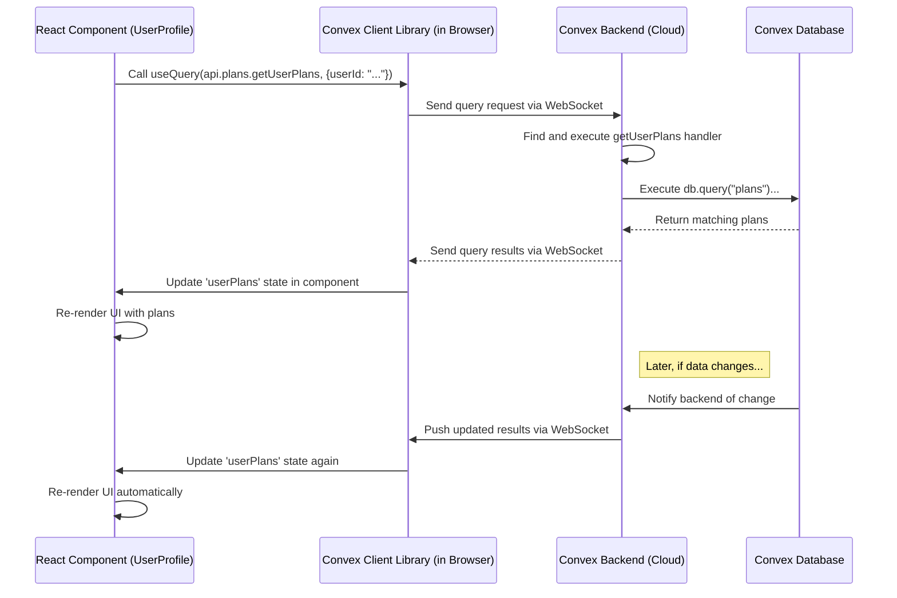

# Chapter 4: Convex Backend & Data

In [Chapter 3: UI Component System (Shadcn UI & Tailwind)](03_ui_component_system__shadcn_ui___tailwind__.md), we learned how the Hevy Gym Trainer app gets its looks using components and styling tools. Now, let's dive into the "brain" behind the app – the system that remembers your information and performs tasks for you. Where does your user profile or your generated fitness plan actually get stored? How does the app fetch it back when you need it?

**Our Goal:** Understand what **Convex** is and how it acts as the backend (the server-side brain and memory) for our application, storing data like user information and fitness plans, and providing functions to access or change that data.

## What Problem Does This Solve?

Imagine you use the app, create a fantastic fitness plan, and then close the app. When you open it again, you'd expect your plan to still be there, right? If the app only lived in your browser (the frontend), all that information would disappear!

We need a central, reliable place to:

1.  **Store data permanently:** Keep user profiles, fitness plans, preferences, etc., safe even when the user closes the app or switches devices.
2.  **Manage data access:** Allow the frontend (what you see in the browser) to request data (like fetching your profile) or update data (like saving a new plan).
3.  **Run logic securely:** Perform actions that shouldn't happen in the browser, like complex calculations or interactions with other services (like the AI for plan generation, covered in [Chapter 7: AI Fitness Plan Generation](07_ai_fitness_plan_generation_.md)).
4.  **Handle background tasks:** Do things automatically, like updating user data when they sign up (as we saw with Clerk webhooks in [Chapter 2: Clerk User Management](02_clerk_user_management_.md)).

Building and managing traditional servers for this is complex. That's where **Convex** helps us.

## Meet Convex: Our App's Librarian & Memory

Think of **Convex** as our application's super-smart, always-available librarian living in the cloud.

*   **Long-Term Memory (Database):** Convex provides a database – like the library's entire collection of books – where all our application data (user info, plans) is stored securely and organized. We define how this data is organized in our [Chapter 5: Database Schema](05_database_schema_.md).
*   **Librarian Functions (Queries & Mutations):** Convex lets us write special functions that act like requests to the librarian:
    *   **Queries:** Functions to *read* or *fetch* data (like asking the librarian to find a specific book or a list of books on a topic). They don't change any data.
    *   **Mutations:** Functions to *change* data – *add*, *update*, or *delete* information (like asking the librarian to add a new book, update a book's details, or remove an old one).
*   **Event Handling (Actions & Scheduling):** Convex can also run functions automatically in response to events (like a user signing up) or on a schedule. These are often called "Actions" in Convex and can perform tasks like talking to external services (e.g., the AI) or sending notifications.
*   **Serverless Magic:** The best part? Convex is "serverless." This doesn't mean there are *no* servers, but it means *we* don't have to worry about managing them (setting them up, updating them, making sure they don't crash). Convex handles all that infrastructure for us, letting us focus purely on writing the code for our app's logic and data handling.

All the code for our Convex backend lives in the `convex/` directory of our project.

## Key Concepts

1.  **Backend:** The part of the application that runs on servers, handling data storage, core logic, and security. Users don't interact with it directly, but the frontend does.
2.  **Database:** An organized collection of data. In Convex, it's like a set of tables (e.g., a `users` table, a `plans` table), where each row represents an item (like a specific user or plan) and columns represent its properties (like `name`, `email`, `workoutPlan`).
3.  **Queries (`query`):** Special JavaScript functions defined in our `convex/` folder (e.g., in `convex/plans.ts`) that are designed only to *read* data from the Convex database. They are safe and cannot accidentally change data.
4.  **Mutations (`mutation`):** JavaScript functions defined in `convex/` (e.g., `convex/plans.ts` or `convex/users.ts`) that are allowed to *write* (create, update, delete) data in the database.
5.  **Schema (`convex/schema.ts`):** A file that defines the structure of our database tables – what tables exist, what fields (columns) each table has, and what type of data each field holds (e.g., text, number, boolean). This ensures our data is consistent. We'll explore this in [Chapter 5: Database Schema](05_database_schema_.md).
6.  **Convex Client Libraries (`convex/react`):** Tools (like special React Hooks) provided by Convex that make it easy for our Next.js frontend to call the queries and mutations defined in our backend. Examples are `useQuery` and `useMutation`.

## How We Use Convex: Saving and Loading a Fitness Plan

Let's walk through our main use case: saving a newly generated fitness plan and then loading it later to display it on the user's profile page.

**1. Saving a New Plan (Frontend calls a Mutation)**

Imagine the AI has just generated a workout and diet plan. Our frontend needs to tell Convex to save it.

**`src/app/generate-program/page.tsx` (Simplified Frontend Component)**

```typescript
"use client"; // This component runs in the browser

import { useMutation } from "convex/react"; // Import the hook to call mutations
import { api } from "../../../convex/_generated/api"; // Import generated API routes
import { Button } from "@/components/ui/button"; // Our UI Button

function PlanGenerator() {
  // 1. Get the mutation function from Convex
  const savePlan = useMutation(api.plans.createPlan);

  const handleSavePlan = async () => {
    // 2. Define the plan data (replace with actual generated data)
    const newWorkoutPlan = { schedule: ["Mon", "Wed", "Fri"], exercises: [/*...*/] };
    const newDietPlan = { dailyCalories: 2200, meals: [/*...*/] };
    const userId = "user_clerk_id_123"; // Get the actual logged-in user ID

    try {
      // 3. Call the mutation with the plan data
      await savePlan({
        userId: userId,
        name: "My New Awesome Plan",
        workoutPlan: newWorkoutPlan,
        dietPlan: newDietPlan,
        isActive: true, // Make this the currently active plan
      });
      alert("Plan saved successfully!");
    } catch (error) {
      alert("Failed to save plan.");
      console.error(error);
    }
  };

  return <Button onClick={handleSavePlan}>Save My Plan</Button>;
}

export default PlanGenerator;
```

*   **Explanation:**
    1.  We import `useMutation` from Convex's React library.
    2.  `useMutation(api.plans.createPlan)` connects our component to the `createPlan` mutation function defined in our Convex backend (`convex/plans.ts`). `api.plans.createPlan` is a typesafe reference generated automatically by Convex.
    3.  When the user clicks the "Save My Plan" button, the `handleSavePlan` function is called.
    4.  Inside `handleSavePlan`, we gather the necessary data (user ID, plan details).
    5.  We call `savePlan({...})`, passing the data as an object. This sends a request to the Convex backend to run the `createPlan` mutation.

**2. How Convex Saves the Plan (Backend Mutation Logic)**

The `savePlan` call triggers the corresponding function in our Convex backend.

**`convex/plans.ts` (Simplified Backend Mutation)**

```typescript
import { mutation } from "./_generated/server"; // Import the mutation helper
import { v } from "convex/values"; // Import validators for arguments

// Define the 'createPlan' mutation
export const createPlan = mutation({
  // 1. Define expected arguments and their types (validation)
  args: {
    userId: v.string(),
    name: v.string(),
    workoutPlan: v.object({ /* ... workout structure ... */ }),
    dietPlan: v.object({ /* ... diet structure ... */ }),
    isActive: v.boolean(),
  },
  // 2. The function logic that runs on the Convex backend
  handler: async (ctx, args) => {
    // 'ctx' provides context, like access to the database (ctx.db)
    // 'args' contains the data sent from the frontend

    // Optional: Deactivate other plans for this user (example logic)
    // const activePlans = await ctx.db.query("plans")... ;
    // for (const plan of activePlans) { await ctx.db.patch(...); }

    // 3. Insert the new plan data into the 'plans' table in the database
    const planId = await ctx.db.insert("plans", {
      userId: args.userId,
      name: args.name,
      workoutPlan: args.workoutPlan,
      dietPlan: args.dietPlan,
      isActive: args.isActive,
      // Convex automatically adds _id and _creationTime fields
    });

    console.log(`Plan ${planId} created for user ${args.userId}`);
    return planId; // Optionally return the ID of the new plan
  },
});
```

*   **Explanation:**
    1.  We define the function using `mutation`.
    2.  `args`: We define the expected input data (`userId`, `name`, etc.) and their types using `v` (validators from `convex/values`). Convex automatically checks if the data sent from the frontend matches this structure.
    3.  `handler`: This is the core logic. It receives `ctx` (context, including `ctx.db` for database access) and `args` (the validated data).
    4.  `ctx.db.insert("plans", { ... })`: This is the command to add a new row (document) to the `plans` table in the database, using the data passed in `args`. Convex handles the actual database write operation securely and reliably.

**3. Loading Plans (Frontend calls a Query)**

Now, let's say the user navigates to their profile page, and we want to display their saved plans.

**`src/app/profile/page.tsx` (Simplified Frontend Component)**

```typescript
"use client";

import { useQuery } from "convex/react"; // Import the hook to call queries
import { api } from "../../../convex/_generated/api"; // Import generated API routes

function UserProfile() {
  const userId = "user_clerk_id_123"; // Get the actual logged-in user ID

  // 1. Fetch the user's plans using the useQuery hook
  const userPlans = useQuery(api.plans.getUserPlans, { userId: userId });

  return (
    <div>
      <h2>My Fitness Plans</h2>
      {/* 2. Handle loading state */}
      {userPlans === undefined && <p>Loading plans...</p>}

      {/* 3. Display the plans once loaded */}
      {userPlans && userPlans.length === 0 && <p>No plans saved yet.</p>}
      {userPlans && userPlans.map((plan) => (
        <div key={plan._id}> {/* Use Convex's auto-generated _id */}
          <h3>{plan.name}</h3>
          {/* Display plan details here... */}
        </div>
      ))}
    </div>
  );
}

export default UserProfile;
```

*   **Explanation:**
    1.  We import `useQuery` from Convex's React library.
    2.  `useQuery(api.plans.getUserPlans, { userId: userId })` calls the `getUserPlans` query function defined in `convex/plans.ts`, passing the `userId` as an argument.
    3.  **Realtime Magic:** `useQuery` is special! It automatically fetches the data initially. If the data changes in the database later (e.g., a new plan is added), Convex automatically pushes the update to the component, and `userPlans` will update, causing the UI to re-render without needing manual refresh!
    4.  While loading, `userPlans` will be `undefined`. Once loaded, it will contain an array of plan objects (or an empty array if none exist). We use conditional rendering to show a loading message or the list of plans.

**4. How Convex Fetches Plans (Backend Query Logic)**

The `useQuery` call triggers the `getUserPlans` function on the backend.

**`convex/plans.ts` (Simplified Backend Query)**

```typescript
import { query } from "./_generated/server"; // Import the query helper
import { v } from "convex/values";

// Define the 'getUserPlans' query
export const getUserPlans = query({
  // 1. Define expected arguments and their types
  args: { userId: v.string() },

  // 2. The function logic that runs on the Convex backend
  handler: async (ctx, args) => {
    // 'ctx' provides context (ctx.db), 'args' has the userId

    // 3. Fetch plans from the 'plans' table where 'userId' matches
    const plans = await ctx.db
      .query("plans") // Start querying the 'plans' table
      // Use an index for faster lookups (defined in schema.ts)
      .withIndex("by_user_id", (q) => q.eq("userId", args.userId))
      .order("desc") // Optional: Sort by creation time (newest first)
      .collect(); // Execute the query and get the results as an array

    // 4. Return the fetched plans
    return plans;
  },
});
```

*   **Explanation:**
    1.  We define the function using `query`. Queries can *only read* data.
    2.  `args`: We define the expected `userId` argument.
    3.  `handler`: This logic runs on the Convex backend.
    4.  `ctx.db.query("plans")...collect()`: This builds and executes a database query.
        *   `.query("plans")`: Specifies which table to read from.
        *   `.withIndex("by_user_id", ...)`: Uses a database index (like an index in a book) for efficient searching based on the `userId` field. This makes fetching much faster, especially with lots of data. Indexes are defined in `convex/schema.ts`.
        *   `.eq("userId", args.userId)`: Filters the results to only include plans where the `userId` field matches the `userId` passed from the frontend.
        *   `.order("desc")`: Sorts the results (optional).
        *   `.collect()`: Runs the query and returns the matching documents (plans) as an array.
    5.  The array of plans is returned to the frontend, where `useQuery` makes it available to the React component.

## Under the Hood: Frontend to Backend Communication

When your React component calls `useQuery(api.plans.getUserPlans, { userId: "..." })`:

1.  **Hook Call:** `useQuery` is called in your component.
2.  **Convex Client:** The Convex React library (`convex/react`) running in the browser uses the `api.plans.getUserPlans` reference (which points to the actual backend function).
3.  **WebSocket Connection:** The Convex client sends a message over a secure WebSocket connection (a persistent, real-time connection established when the app loads) to the Convex backend infrastructure. This message essentially says, "Run the `getUserPlans` query with these arguments (`{ userId: "..." }`)."
4.  **Backend Execution:** The Convex backend receives the request, finds the `getUserPlans` function code in `convex/plans.ts`, validates the arguments against the `args` definition, and executes the `handler` function.
5.  **Database Read:** The `handler` interacts with the Convex database (`ctx.db.query(...)`) to fetch the required data.
6.  **Response:** The `handler` returns the results (the array of plans).
7.  **Data Transmission:** The Convex backend sends the results back to the Convex client in the browser over the WebSocket connection.
8.  **Component Update:** The `useQuery` hook receives the data and updates the state of your React component (`userPlans`), causing it to re-render with the fetched data.
9.  **Subscription (Realtime):** `useQuery` also sets up a subscription. If the data returned by `getUserPlans` changes in the database later, the Convex backend proactively pushes the *new* results down the WebSocket, and `useQuery` updates the component again automatically.



This seamless connection, powered by Convex's infrastructure and client libraries, allows us to write frontend code that interacts with the backend almost as if it were calling local functions, while getting the benefits of a persistent database, serverless execution, and real-time updates.

## Conclusion

We've uncovered the "brain" of our Hevy Gym Trainer app: **Convex**. It acts as our serverless backend, providing a reliable database to store information like user profiles and fitness plans, and allowing us to define functions (`queries` to read, `mutations` to write) to interact with that data. We saw how easily our Next.js frontend can call these backend functions using Convex's React hooks (`useQuery`, `useMutation`), enabling us to save and load data seamlessly. Convex handles the complexities of server management and even provides real-time data synchronization, making development much simpler.

But how exactly do we tell Convex *what* our data should look like? How do we define the structure of the `users` and `plans` tables? That's defined in the schema.

**Next Up:** [Chapter 5: Database Schema](05_database_schema_.md)

---

Generated by [AI Codebase Knowledge Builder](https://github.com/The-Pocket/Tutorial-Codebase-Knowledge)