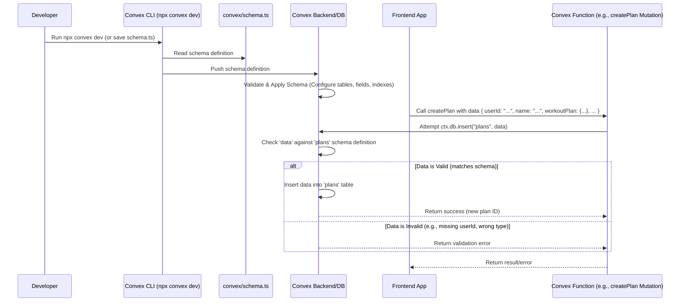

# Chapter 5: Database Schema

Welcome back! In [Chapter 4: Convex Backend & Data](04_convex_backend___data__.md), we discovered how **Convex** acts as our app's memory and brain, storing data like user profiles and fitness plans using queries and mutations. But how does Convex know exactly *what* information belongs in a user profile or a fitness plan? How does it keep everything organized and prevent us from accidentally saving, say, a user's favorite color where their email address should go?

That's where the **Database Schema** comes in.

**Our Goal:** Understand what a database schema is and how the `convex/schema.ts` file defines the structure and rules for the data stored in our Convex database.

## What Problem Does This Solve?

Imagine you have a filing cabinet for your gym members. If you just tossed pieces of paper in randomly – some with names, some with workout notes, some with just phone numbers, maybe some shopping lists – it would quickly become a useless mess. You wouldn't be able to reliably find a specific member's complete information.

We need a clear plan for our digital filing cabinet (the database). We need to decide *beforehand*:

1.  What "folders" (tables) will we have? (e.g., one for `users`, one for `plans`).
2.  What specific pieces of information (fields) must be included in each "file" (record/document)? (e.g., a user *must* have an email, a plan *must* have workout details).
3.  What *type* of information should each piece be? (e.g., an email should be text, the number of calories should be a number).

This plan is the **Database Schema**. It acts like a blueprint for our database, ensuring that data is stored consistently and predictably.

## Meet the Blueprint: `convex/schema.ts`

Think of the database schema as the official design document for your filing cabinets. It specifies:

*   **Cabinets (Tables):** Which main categories of information you'll store. In our app, we mainly have `users` and `plans`.
*   **File Templates (Documents/Records):** What a standard file in each cabinet should look like. Every user record will follow the user template, and every plan record will follow the plan template.
*   **Form Fields (Fields/Properties):** The specific labelled boxes on each template. For a `users` file, you'll have boxes labelled "Name", "Email", "Clerk ID", etc. For a `plans` file, you'll have boxes for "Workout Details", "Diet Details", "Is Active?".
*   **Field Rules (Data Types):** What kind of entry is allowed in each box. "Name" must contain text (a `string`), "Daily Calories" must contain a number (a `number`), "Is Active?" must be a simple yes/no (a `boolean`).

In our project, this entire blueprint is defined in one crucial file: `convex/schema.ts`.

## Key Concepts

1.  **Schema:** The overall definition of the database structure, including all tables, fields, types, and indexes. Defined using `defineSchema` in `convex/schema.ts`.
2.  **Table:** A collection of related data records (documents). Defined using `defineTable` (e.g., `users`, `plans`). Analogous to a spreadsheet or a filing cabinet drawer.
3.  **Document (or Record):** A single item within a table (e.g., one user's data, one specific fitness plan). Analogous to a row in a spreadsheet or a single file in a drawer. Convex automatically gives each document a unique `_id`.
4.  **Field (or Property):** A specific piece of information within a document (e.g., `name`, `email`, `workoutPlan`). Analogous to a column in a spreadsheet or a labelled box on a form.
5.  **Data Types (`v.*`):** Rules that specify what kind of value a field can hold. Convex uses validators from `convex/values` (imported as `v`). Common types include:
    *   `v.string()`: Text.
    *   `v.number()`: Numbers (integers or decimals).
    *   `v.boolean()`: True or false.
    *   `v.object({ ... })`: A nested structure containing more fields (like the `workoutPlan` details).
    *   `v.array(type)`: A list of items of a specific `type` (like `v.array(v.string())` for a list of exercise names).
    *   `v.optional(type)`: Indicates that a field might be present or absent (e.g., `v.optional(v.string())` for an optional user image).
6.  **Indexes (`.index(...)`):** Special markers that help Convex quickly find documents based on specific field values, much like an index in the back of a book helps you find pages mentioning a specific term. This speeds up queries significantly. We define indexes in the schema (e.g., find users quickly by their `clerkId`).

## How the Schema is Used

The `convex/schema.ts` file isn't just a comment; Convex actively uses it:

1.  **Validation:** When you try to save data using a `mutation` (like `createPlan` from [Chapter 4: Convex Backend & Data](04_convex_backend___data__.md)), Convex checks the data you're providing against the schema for that table. If you try to save a plan without a `userId` (which is required in the schema), or if you try to put text into the `dailyCalories` field (which requires a `number`), Convex will reject the operation and give an error. This prevents bad data from entering the database.
2.  **Query Optimization:** When you run a `query` that uses an index (like `getUserPlans` querying `.withIndex("by_user_id", ...)`), Convex knows about that index because it was defined in the schema. This allows it to fetch the data much faster than scanning the entire table.
3.  **Code Generation:** When you run `npx convex dev`, Convex reads your schema and generates helper files (like `convex/_generated/api.d.ts`) that provide type safety in your frontend and backend code. This means your code editor can often tell you if you're trying to use a field that doesn't exist or pass the wrong type of data to a query/mutation.

## Diving into the Code: `convex/schema.ts`

Let's look at the actual blueprint for our Hevy Gym Trainer app's data.

**`convex/schema.ts`**

```typescript
// Import tools needed to define the schema and field types
import { defineSchema, defineTable } from "convex/server";
import { v } from "convex/values"; // 'v' is used for defining data types

// Define the overall schema for the database
export default defineSchema({
  // --- Define the 'users' table ---
  users: defineTable({
    // Fields for the 'users' table and their types
    name: v.string(),           // User's name must be text
    email: v.string(),          // User's email must be text
    image: v.optional(v.string()), // User's image URL is text, but optional
    clerkId: v.string(),        // Clerk user ID must be text (links to Clerk)
  })
  // Add an index to quickly find users by their Clerk ID
  .index("by_clerk_id", ["clerkId"]),

  // --- Define the 'plans' table ---
  plans: defineTable({
    // Fields for the 'plans' table and their types
    userId: v.string(),         // ID of the user this plan belongs to (text)
    name: v.string(),           // Name of the plan (text)
    workoutPlan: v.object({     // Workout details (nested structure)
      schedule: v.array(v.string()), // List of workout days (e.g., ["Mon", "Wed"])
      exercises: v.array(       // List of exercise details per day
        v.object({
          day: v.string(),        // Day of the week (text)
          routines: v.array(      // List of routines for that day
            v.object({
              name: v.string(),   // Routine name (text)
              // Optional fields for sets, reps, duration, etc.
              sets: v.optional(v.number()),
              reps: v.optional(v.number()),
              duration: v.optional(v.number()),
              description: v.optional(v.string()),
              exercises: v.optional(v.array(v.string())), // Optional list of exercises within routine
            })
          ),
        })
      ),
    }),
    dietPlan: v.object({        // Diet details (nested structure)
      dailyCalories: v.number(), // Target calories (number)
      meals: v.array(           // List of meal details
        v.object({
          name: v.string(),       // Meal name (e.g., "Breakfast")
          foods: v.array(v.string()), // List of food items (text)
          protein: v.array(v.number()), // List of protein amounts (number)
        })
      ),
    }),
    isActive: v.boolean(),      // Is this the user's currently active plan? (true/false)
  })
  // Add indexes to quickly find plans
  .index("by_user_id", ["userId"])   // Find plans by user ID
  .index("by_active", ["isActive"]), // Find plans based on active status (less common)
});

```

*   **Explanation:**
    *   We use `defineSchema` to wrap the entire database structure.
    *   Inside, `users: defineTable({...})` defines the `users` table.
    *   Within `defineTable`, we list each field name (like `name`, `email`, `clerkId`) followed by its type validator (like `v.string()`). `v.optional()` marks fields that don't have to be present.
    *   `.index("by_clerk_id", ["clerkId"])` creates an index named `by_clerk_id` on the `clerkId` field. This means Convex can very quickly look up a user if you know their `clerkId`.
    *   Similarly, `plans: defineTable({...})` defines the `plans` table.
    *   Notice how complex data like `workoutPlan` and `dietPlan` are defined using nested `v.object()` and `v.array()` types, precisely describing their structure.
    *   The `plans` table has an index `by_user_id` on the `userId` field, which is crucial for efficiently fetching all plans belonging to a specific user (as seen in the `getUserPlans` query in Chapter 4).

## Under the Hood: Applying the Blueprint

How does this `schema.ts` file actually affect the database?

1.  **Development Sync:** When you run `npx convex dev` (or it's running in the background), the Convex command-line tool reads your `convex/schema.ts` file.
2.  **Schema Validation & Push:** The CLI validates your schema definition (checks for errors in how you've defined things) and then sends this definition up to the Convex backend infrastructure in the cloud.
3.  **Database Configuration:** The Convex backend receives the schema and configures your cloud database accordingly. It ensures the specified tables (`users`, `plans`) exist, understands the required fields and their types for each table, and builds the defined indexes (`by_clerk_id`, `by_user_id`).
4.  **Runtime Enforcement:** Now, whenever your app's backend functions (queries or mutations) interact with the database:
    *   **Mutations:** Before inserting or updating data, Convex checks if the data conforms to the schema rules (correct fields, correct types). If not, it rejects the change.
    *   **Queries:** When filtering or searching (especially using `.withIndex()`), Convex uses the schema's index information to perform the lookup efficiently.

Here’s a simplified diagram showing how the schema is applied and used:



This schema acts as a contract, ensuring that both the code writing data and the code reading data have the same understanding of how the information is structured, leading to a more robust and maintainable application.

## Conclusion

We've learned that the **Database Schema**, defined in `convex/schema.ts`, is the essential blueprint for our application's data stored in Convex. It dictates the tables (`users`, `plans`), the fields within them (`name`, `email`, `workoutPlan`), the required data types (`v.string()`, `v.number()`, `v.object`), and provides indexes (`by_clerk_id`, `by_user_id`) for efficient data retrieval. This schema ensures data consistency, prevents errors, and enables Convex to optimize queries. It's the foundation upon which our data operations, like those we saw in [Chapter 4: Convex Backend & Data](04_convex_backend___data__.md), are built.

With our data structure defined, we can now explore more interactive parts of the application. How does the app actually *talk* to the user using voice?

**Next Up:** [Chapter 6: Vapi Voice Assistant Interaction](06_vapi_voice_assistant_interaction_.md)

---

Generated by [AI Codebase Knowledge Builder](https://github.com/The-Pocket/Tutorial-Codebase-Knowledge)