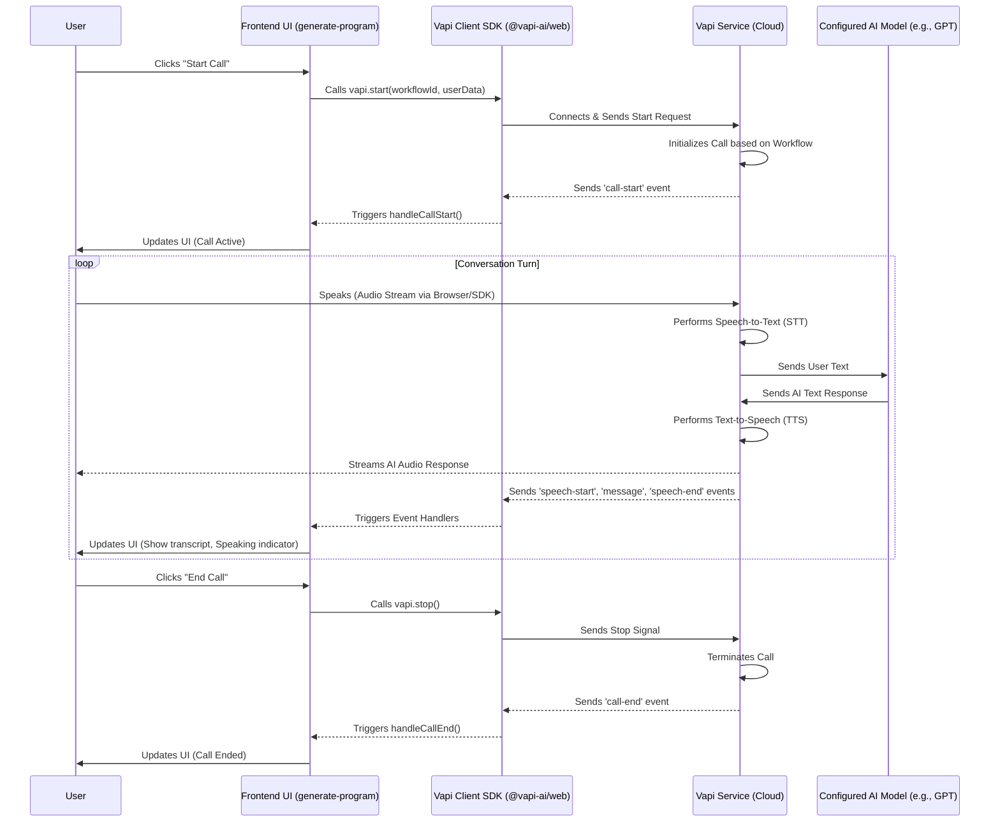

# Chapter 6: Vapi Voice Assistant Interaction

In the previous chapter, [Chapter 5: Database Schema](05_database_schema_.md), we designed the blueprint for how our application's data is structured in the Convex database. We know how to store user profiles and fitness plans. But how does the app *get* the information needed to create a personalized fitness plan in the first place? Typing out all your goals, preferences, and available time can be tedious. Wouldn't it be cooler if you could just *tell* the app what you need?

That's exactly what this chapter is about!

**Our Goal:** Understand how the "Generate Program" page uses the **Vapi** service to let you have a real-time voice conversation with the AI assistant (Fitmax AI) to gather the information needed for your personalized fitness plan.

## What Problem Does This Solve?

Creating a truly personalized fitness plan requires understanding the user's specific needs:

*   What are your fitness goals (lose weight, build muscle, run a marathon)?
*   How much time can you commit each week?
*   What equipment do you have access to?
*   Any dietary restrictions or preferences?

Asking the user to fill out a long form with all these questions can be boring and might lead to incomplete information. A natural conversation is often much easier and more engaging.

We need a system that can:

1.  Listen to the user speaking through their microphone.
2.  Convert that speech into text for the AI to understand.
3.  Take the AI's text response.
4.  Convert that text back into audible speech for the user to hear.
5.  Manage the back-and-forth flow of the conversation smoothly.

Building all this voice technology from scratch is incredibly complex. That's where **Vapi** comes in.

## Meet Vapi: Our App's Smart Microphone & Speaker System

Think of **Vapi** as a specialized service that handles all the complicated parts of having a voice conversation with an AI. It acts like a sophisticated microphone and speaker system connected directly to our AI assistant's brain.

*   **Microphone (Speech-to-Text):** Vapi listens to your voice input via the browser's microphone and quickly turns your spoken words into written text.
*   **Speaker (Text-to-Speech):** When the AI assistant generates a text response (like asking a question or providing information), Vapi converts that text into natural-sounding speech and plays it back to you through your speakers or headphones.
*   **Conversation Manager:** Vapi manages the technical details of the call – starting it, ending it, handling audio streams, and coordinating when the AI should speak and when it should listen.
*   **Integration:** Vapi connects to the underlying AI model (the one that actually figures out what to say, which we'll cover in [Chapter 7: AI Fitness Plan Generation](07_ai_fitness_plan_generation_.md)) and bridges the gap between the text-based AI and the voice-based user interaction.

We interact with the Vapi service from our frontend code using their client library (`@vapi-ai/web`).

## Key Concepts

1.  **Voice Conversation:** Real-time interaction using spoken language instead of typing.
2.  **Speech-to-Text (STT):** The technology that converts audio speech into written text.
3.  **Text-to-Speech (TTS):** The technology that converts written text into synthesized audio speech.
4.  **Vapi Service:** The cloud-based platform that provides the STT, TTS, and call management infrastructure. We configure our assistant (like which AI model to use and its instructions) on the Vapi dashboard online.
5.  **Vapi Client SDK (`@vapi-ai/web`):** A JavaScript library we use in our Next.js frontend (`src/app/generate-program/page.tsx`) to connect to the Vapi service, start/stop calls, and listen for events.
6.  **Vapi Workflow ID:** A unique identifier for the specific assistant configuration we set up in the Vapi dashboard. Our frontend code uses this ID to tell Vapi *which* assistant to connect the user to.
7.  **Vapi Events:** Notifications sent from the Vapi service back to our frontend via the SDK. We listen for these events to know what's happening in the conversation. Key events include:
    *   `call-start`: The voice call has successfully begun.
    *   `call-end`: The voice call has ended.
    *   `speech-start`: The AI has started speaking.
    *   `speech-end`: The AI has finished speaking.
    *   `message`: A new message (usually a transcript of what was said by either the user or the AI) is available.
    *   `error`: Something went wrong with the call.

## How We Use Vapi: Talking to Fitmax AI

Let's look at how the "Generate Program" page uses Vapi to enable the voice chat.

**1. Setting up the Vapi Client:**

First, we need a way to interact with the Vapi service. We initialize the Vapi client library with our unique API key.

**`src/vapi.ts` (Simplified)**

```typescript
import Vapi from "@vapi-ai/web"; // Import the Vapi library

// Initialize Vapi with the API key (stored securely as an environment variable)
export const vapi = new Vapi(process.env.NEXT_PUBLIC_VAPI_API_KEY!);
```

*   **Explanation:** This small file creates a single instance of the Vapi client using our secret API key (provided by Vapi). We can now import `vapi` from this file anywhere in our frontend code.

**2. Starting and Stopping the Call:**

On the "Generate Program" page, there's a button to start and end the voice conversation.

**`src/app/generate-program/page.tsx` (Simplified `toggleCall` function)**

```typescript
// ... other imports and state variables (callActive, connecting, user) ...
import { vapi } from "@/vapi"; // Import our initialized Vapi client

const toggleCall = async () => {
  if (callActive) {
    // If the call is currently active, stop it
    vapi.stop();
  } else {
    try {
      setConnecting(true); // Show a connecting indicator in the UI
      setMessages([]);    // Clear previous messages
      setCallEnded(false);  // Reset the ended state

      // Prepare user details to pass to the AI
      const fullName = user?.firstName ? `${user.firstName} ${user.lastName || ""}`.trim() : "There";

      // Start the call using the Workflow ID and pass user details
      await vapi.start(process.env.NEXT_PUBLIC_VAPI_WORKFLOW_ID!, {
        variableValues: {
          full_name: fullName,
          user_id: user?.id, // Pass the user's unique Clerk ID
        },
      });
      // Note: 'call-start' event will update state, no need to setCallActive(true) here
    } catch (error) {
      console.log("Failed to start call", error);
      setConnecting(false); // Reset connecting indicator on error
    }
  }
};

// ... in the JSX ...
<Button onClick={toggleCall} disabled={connecting || callEnded}>
  {/* Button text changes based on state (Start Call, End Call, Connecting...) */}
  {callActive ? "End Call" : connecting ? "Connecting..." : "Start Call"}
</Button>
```

*   **Explanation:**
    *   When the user clicks the button:
        *   If a call is `callActive`, `vapi.stop()` is called to end the conversation.
        *   If no call is active, it sets a `connecting` state, clears old messages, and then calls `vapi.start()`.
    *   `vapi.start()` takes two important arguments:
        *   The **Workflow ID** (from `process.env.NEXT_PUBLIC_VAPI_WORKFLOW_ID!`): Tells Vapi which specific AI assistant configuration to use (we set this up on the Vapi website).
        *   `variableValues`: An object containing information we want to pass to the assistant at the beginning of the call, like the user's name (`full_name`) and their unique ID (`user_id` from Clerk). This allows the AI to personalize the conversation (e.g., "Hi John!") and later associate the generated plan with the correct user (using the `user_id`).
    *   The actual setting of `callActive` to `true` happens when the `'call-start'` event is received (see next section).

**3. Listening to Conversation Events:**

How does the page know when the call actually starts, when the AI is speaking, or what's being said? It listens for events from the Vapi SDK.

**`src/app/generate-program/page.tsx` (Simplified `useEffect` for Vapi events)**

```typescript
// ... other imports and state variables ...
import { useEffect, useState } from "react";
import { vapi } from "@/vapi";

useEffect(() => {
  // Define functions to handle different events
  const handleCallStart = () => {
    console.log("Call started");
    setConnecting(false); // Turn off connecting indicator
    setCallActive(true);  // Set call as active
    setCallEnded(false);
  };

  const handleCallEnd = () => {
    console.log("Call ended");
    setCallActive(false); // Call is no longer active
    setConnecting(false);
    setIsSpeaking(false);
    setCallEnded(true); // Mark call as ended (used for redirect)
  };

  const handleSpeechStart = () => setIsSpeaking(true); // AI started talking
  const handleSpeechEnd = () => setIsSpeaking(false); // AI stopped talking

  const handleMessage = (message: any) => {
    // Only add final transcripts to the message list
    if (message.type === "transcript" && message.transcriptType === "final") {
      const newMessage = { content: message.transcript, role: message.role };
      setMessages((prev) => [...prev, newMessage]); // Add message to display
    }
  };

  const handleError = (error: any) => { /* ... handle errors ... */ };

  // Register the handlers with the Vapi client
  vapi
    .on("call-start", handleCallStart)
    .on("call-end", handleCallEnd)
    .on("speech-start", handleSpeechStart)
    .on("speech-end", handleSpeechEnd)
    .on("message", handleMessage)
    .on("error", handleError);

  // Cleanup: Remove listeners when the component unmounts
  return () => {
    vapi
      .off("call-start", handleCallStart)
      // ... remove other listeners ...
      .off("error", handleError);
  };
}, []); // Empty dependency array ensures this runs only once on mount
```

*   **Explanation:**
    *   This `useEffect` hook runs once when the page component loads.
    *   It defines several handler functions (`handleCallStart`, `handleCallEnd`, etc.). Each function updates the component's state variables (`callActive`, `isSpeaking`, `messages`, `callEnded`) based on the event.
    *   `vapi.on("event-name", handlerFunction)` tells the Vapi SDK: "When you receive the 'event-name' from the Vapi service, please run this `handlerFunction`."
    *   For example, when the call successfully connects, Vapi sends a `call-start` event, which triggers `handleCallStart`, setting `callActive` to `true` and updating the UI accordingly.
    *   When the AI speaks, `speech-start` and `speech-end` events trigger updates to `isSpeaking`, which controls the visual indicator on the AI assistant's card.
    *   The `handleMessage` function receives transcripts and adds them to the `messages` array, which is then displayed in the chat log area on the page.
    *   The `return` function inside `useEffect` is a cleanup function. It removes the event listeners when the user navigates away from the page, preventing potential issues.

Using these pieces (`vapi.ts`, `toggleCall`, and the event listeners), the "Generate Program" page orchestrates the voice interaction with the AI assistant via the Vapi service.

## Under the Hood: A Voice Conversation's Journey

What happens behind the scenes when you click "Start Call"?

1.  **Click:** You click the "Start Call" button on the `GenerateProgramPage`.
2.  **Frontend Action:** The `toggleCall` function in `src/app/generate-program/page.tsx` is executed.
3.  **SDK Call:** It calls `vapi.start()` using the Vapi Client SDK (`@vapi-ai/web`). Your Workflow ID and user details are included.
4.  **Connection & Permissions:** The SDK connects securely to the Vapi Service in the cloud via WebSockets. It also prompts you for microphone access in your browser.
5.  **Vapi Service Init:** The Vapi Service receives the request, looks up your Workflow ID to find the assistant configuration (like AI model, voice settings, initial prompts - all set up on the Vapi website).
6.  **Call Start:** Vapi establishes the call infrastructure.
7.  **Event Fired:** Vapi Service sends a `call-start` event back to your browser via the WebSocket.
8.  **Frontend Update:** The Vapi SDK receives the event and triggers the `handleCallStart` function you registered, which updates the page's state (`setCallActive(true)`). The UI changes (e.g., button text becomes "End Call").
9.  **User Speaks:** You talk into your microphone. The audio is streamed directly to the Vapi Service.
10. **STT:** Vapi's Speech-to-Text engine converts your audio into text.
11. **AI Interaction:** Vapi sends this text to the configured AI model (e.g., OpenAI's GPT).
12. **AI Response:** The AI processes the text and generates a text response (e.g., asking you a question).
13. **TTS:** Vapi receives the AI's text response and uses its Text-to-Speech engine to convert it into audio.
14. **Audio Streaming:** Vapi streams this generated audio back to your browser.
15. **User Hears:** You hear the AI assistant speak.
16. **Events Fired:** During this AI response:
    *   Vapi sends `speech-start` when TTS begins.
    *   Vapi sends `message` events containing transcripts (of both user and AI speech).
    *   Vapi sends `speech-end` when TTS finishes.
17. **Frontend Updates:** Your frontend code's event handlers update the UI (showing transcripts in the message list, toggling the speaking indicator).
18. **Conversation Continues:** Steps 9-17 repeat as you and the AI talk back and forth.
19. **End Call:** You click "End Call". `toggleCall` runs `vapi.stop()`.
20. **Signal Sent:** The SDK sends a stop signal to the Vapi Service.
21. **Call Teardown:** Vapi Service ends the call and releases resources.
22. **Event Fired:** Vapi Service sends a `call-end` event back.
23. **Frontend Update:** `handleCallEnd` runs, updating state (`setCallActive(false)`, `setCallEnded(true)`), and the UI reflects the ended call.

Here's a simplified diagram of the main interaction loop:



This flow allows our simple frontend code to leverage Vapi's powerful backend infrastructure for complex voice interactions.

## Conclusion

We've seen how the Hevy Gym Trainer app uses the **Vapi** service and its JavaScript SDK (`@vapi-ai/web`) to enable real-time voice conversations on the "Generate Program" page. Vapi handles the heavy lifting of speech-to-text, text-to-speech, and managing the call flow. Our frontend code simply needs to initialize the Vapi client, start/stop calls using a specific Workflow ID, and listen for events (`call-start`, `call-end`, `message`, etc.) to update the UI and display the conversation. This provides a natural and engaging way for users to provide the details needed for their personalized plan.

But Vapi only handles the *conversation* part. How does the AI actually understand the user's input and generate the fitness plan content based on the conversation? That's the brain of the operation we'll explore next.

**Next Up:** [Chapter 7: AI Fitness Plan Generation](07_ai_fitness_plan_generation_.md)

---

Generated by [AI Codebase Knowledge Builder](https://github.com/The-Pocket/Tutorial-Codebase-Knowledge)