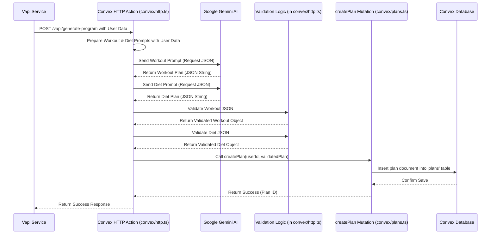

# Chapter 7: AI Fitness Plan Generation

Welcome back! In [Chapter 6: Vapi Voice Assistant Interaction](06_vapi_voice_assistant_interaction_.md), we learned how our app uses Vapi to have a voice conversation with you, gathering all the important details about your fitness goals, preferences, and limitations. That's pretty cool, but collecting information is only half the battle. How does the app actually take that conversation and turn it into a real, personalized workout and diet plan just for you?

**Our Goal:** Understand the magic behind the scenes – how the Hevy Gym Trainer app uses an Artificial Intelligence (AI) model (Google Gemini) to generate your unique fitness plan based on the information gathered, and how it saves that plan to your profile.

## What Problem Does This Solve?

Imagine you just finished talking to the Fitmax AI assistant. You told it your age, weight, goals (like "build muscle"), how many days you can work out, and any injuries. Now what? Someone (or something!) needs to act like an expert personal trainer and nutritionist, take all those details, and actually *write* the plan:

*   Which exercises should you do on which days?
*   How many sets and reps for each exercise?
*   What kind of meals should you eat?
*   How many calories should you aim for?

Designing a safe, effective, and personalized plan requires expertise. Manually creating these for every user would be impossible. This is where AI shines!

**Our Use Case:** How does the information from your voice chat get transformed into a structured workout and diet plan stored in our database?

## Meet the AI Planner: Gemini & Convex

Think of this process like consulting a virtual expert team:

1.  **The Coordinator (Convex HTTP Action):** After your voice call ends, Vapi (or another trigger) sends all the collected information (your goals, stats, etc.) to a special function running in our [Chapter 4: Convex Backend & Data](04_convex_backend___data__.md). This function, specifically an **HTTP Action** in Convex (located in `convex/http.ts`), acts as the coordinator. It knows what to do with the information.
2.  **The Expert Writer (Google Gemini AI):** The coordinator function takes your details and sends them to a powerful AI model called **Google Gemini**. Gemini is like a super-knowledgeable fitness expert and nutritionist who can read instructions and write detailed plans.
3.  **The Instructions (Prompts):** The coordinator doesn't just dump your info onto Gemini. It sends very specific instructions, called **prompts**. These prompts tell Gemini *exactly* what kind of plan to create (workout or diet), *what information to consider* (your details), and, crucially, *how to format the response*.
4.  **The Structured Plan (JSON Output):** We need the plan back in a format our app can easily understand and save. So, the prompt asks Gemini to return the plan as **JSON** (JavaScript Object Notation) – a highly structured text format that looks like `{ "key": "value", "list": [...] }`. This is much better than just getting back a paragraph of text.
5.  **The Quality Check (Validation):** AI is amazing, but sometimes it might make a small mistake or not follow instructions perfectly. Before saving the plan, our coordinator function runs a **validation** check. It ensures the JSON received from Gemini matches the structure we expect (defined in our [Chapter 5: Database Schema](05_database_schema_.md)) and fixes minor issues (like ensuring numbers are actually numbers, not text).
6.  **Saving the Record (Convex Mutation):** Once the plan passes the quality check, the coordinator calls a **Convex Mutation** (the `createPlan` function we saw in [Chapter 4: Convex Backend & Data](04_convex_backend___data__.md)) to save the finalized, structured plan into the `plans` table in our Convex database, linked to your user ID.

This whole process happens automatically in the background after your voice conversation finishes.

## Key Concepts

1.  **AI Model (Google Gemini):** A powerful AI service capable of understanding language and generating creative text, including structured data like workout plans, based on instructions (prompts).
2.  **Prompt Engineering:** The skill of writing clear, detailed instructions (prompts) to guide the AI to produce the desired output format and content.
3.  **Structured Output (JSON):** Requesting the AI to provide its response in a specific, computer-readable format (JSON) that matches our database schema. This makes the AI's output usable by our application.
4.  **Convex HTTP Action:** A special type of Convex backend function designed to be triggered by external services (like Vapi sending data after a call, or any other web request). It acts as the entry point and orchestrator for processes involving external systems like the Gemini AI. Found in `convex/http.ts`.
5.  **Validation:** The process of checking the AI-generated data against our expected schema and rules before saving it, ensuring data quality and preventing errors.
6.  **API Call:** How our Convex function communicates with the external Google Gemini service over the internet, sending the prompt and receiving the response.

## How It Works: From Voice Data to Saved Plan

Let's trace the journey of your information after the Vapi call concludes.

1.  **Data Sent:** Vapi (having gathered details like your age, goals, etc., during the call described in [Chapter 6: Vapi Voice Assistant Interaction](06_vapi_voice_assistant_interaction_.md)) sends this information to a specific URL endpoint in our Convex backend (e.g., `/vapi/generate-program`).
2.  **HTTP Action Triggered:** Convex receives this incoming request at the `/vapi/generate-program` path and triggers the corresponding HTTP Action function defined in `convex/http.ts`.
3.  **Prompts Prepared:** The HTTP Action function takes the received user data (age, goal, etc.) and carefully inserts it into pre-written text templates – the **prompts** for Gemini. There's usually one prompt for the workout plan and another for the diet plan. These prompts include strict instructions about the desired JSON output format.
4.  **AI Called:** The function makes API calls to the Google Gemini service, sending the workout prompt and the diet prompt separately.
5.  **AI Generates:** Gemini processes each prompt, considers your details, and generates the workout and diet plans according to the instructions, formatting them as JSON strings.
6.  **Response Received:** The HTTP Action function receives the JSON responses back from Gemini.
7.  **Validation:** The function parses the JSON strings and runs validation checks (`validateWorkoutPlan`, `validateDietPlan`) to ensure they match our schema (e.g., 'sets' is a number).
8.  **Database Save:** The function calls the `createPlan` Convex mutation (from `convex/plans.ts`), passing the validated workout and diet plan objects, along with your user ID and a plan name.
9.  **Plan Stored:** The `createPlan` mutation saves the complete plan as a new document in the `plans` table in the Convex database.

## Under the Hood: The Coordination Flow

Here's a simplified sequence diagram showing how the different parts interact:



## Diving into the Code

Let's look at simplified snippets from `convex/http.ts` where this happens.

**`convex/http.ts` (Simplified HTTP Action Handler)**

```typescript
import { httpAction } from "./_generated/server";
import { api } from "./_generated/api";
import { GoogleGenerativeAI } from "@google/generative-ai";
// Assume genAI is initialized with API key

// Define the route Vapi calls
http.route({
  path: "/vapi/generate-program",
  method: "POST",
  handler: httpAction(async (ctx, request) => {
    try {
      // 1. Get user data sent by Vapi
      const payload = await request.json();
      const { user_id, age, weight, fitness_goal /* ...other details */ } = payload;

      // 2. Prepare the prompts (simplified examples)
      const workoutPrompt = `Create a workout plan for a ${age}-year-old aiming for ${fitness_goal}.
        Weight: ${weight}. Return ONLY JSON:
        { "schedule": ["Day1", "Day2"], "exercises": [{"day": "Day1", "routines": [{"name": "Squats", "sets": 3, "reps": 10, "duration": 5, "description": "..."}]}] }`;

      const dietPrompt = `Create a diet plan for ${fitness_goal}.
        Return ONLY JSON:
        { "dailyCalories": 2000, "meals": [{"name": "Breakfast", "foods": ["Eggs"], "protein": [12]}] }`;

      // 3. Call Gemini AI
      const model = genAI.getGenerativeModel({ /* ... config ... */ });
      const workoutResult = await model.generateContent(workoutPrompt);
      const dietResult = await model.generateContent(dietPrompt);

      // 4. Parse and Validate the AI's JSON response
      let workoutPlan = JSON.parse(workoutResult.response.text());
      workoutPlan = validateWorkoutPlan(workoutPlan); // Our validation function

      let dietPlan = JSON.parse(dietResult.response.text());
      dietPlan = validateDietPlan(dietPlan); // Our validation function

      // 5. Save the validated plan using a Convex mutation
      const planId = await ctx.runMutation(api.plans.createPlan, {
        userId: user_id,
        workoutPlan,
        dietPlan,
        name: `${fitness_goal} Plan`,
        isActive: true,
      });

      // 6. Return success
      return new Response(JSON.stringify({ success: true, planId }), { status: 200 });

    } catch (error) {
      console.error("Error generating plan:", error);
      return new Response(JSON.stringify({ success: false }), { status: 500 });
    }
  }),
});
```

*   **Explanation:**
    1.  The `httpAction` receives the POST request at `/vapi/generate-program`.
    2.  It extracts the user data from the request body (`payload`).
    3.  It constructs `workoutPrompt` and `dietPrompt`, embedding user data and *critically* specifying the exact JSON structure required in the output.
    4.  It calls the Gemini AI (`model.generateContent`) with each prompt.
    5.  It parses the text response from Gemini into JavaScript objects (`JSON.parse`).
    6.  It passes these objects to our custom `validateWorkoutPlan` and `validateDietPlan` functions for checking and minor corrections.
    7.  It calls the `createPlan` mutation (defined in `convex/plans.ts`) via `ctx.runMutation` to save the final, clean data.
    8.  It sends a success response back.

**`convex/http.ts` (Simplified Validation Functions)**

```typescript
// Example: Validate workout plan structure and types
function validateWorkoutPlan(plan: any) {
  // Ensure 'schedule' is an array of strings, etc.
  // Ensure 'sets', 'reps', 'duration' are numbers, converting if needed
  const validatedPlan = {
    schedule: Array.isArray(plan.schedule) ? plan.schedule : [],
    exercises: (plan.exercises || []).map((ex: any) => ({
      day: String(ex.day || "Unknown"),
      routines: (ex.routines || []).map((r: any) => ({
        name: String(r.name || "Unnamed Routine"),
        sets: Number(r.sets) || 1, // Default to 1 if invalid/missing
        reps: Number(r.reps) || 10, // Default to 10 if invalid/missing
        duration: Number(r.duration) || 15, // Default to 15 if invalid/missing
        description: String(r.description || "No description"),
      })),
    })),
  };
  return validatedPlan;
}

// Example: Validate diet plan structure and types
function validateDietPlan(plan: any) {
  // Ensure 'dailyCalories' is a number, 'meals' is an array, etc.
  const validatedPlan = {
    dailyCalories: Number(plan.dailyCalories) || 2000, // Default if invalid
    meals: (plan.meals || []).map((m: any) => ({
      name: String(m.name || "Unnamed Meal"),
      foods: Array.isArray(m.foods) ? m.foods.map(String) : [],
      protein: Array.isArray(m.protein) ? m.protein.map(Number) : [], // Ensure numbers
    })),
  };
  return validatedPlan;
}
```

*   **Explanation:** These functions take the raw object parsed from the AI's JSON response and enforce our schema rules. They check types (`Array.isArray`, `String`, `Number`) and provide default values if the AI missed something or returned the wrong type (like `"10"` instead of `10`). This ensures the data saved by `createPlan` matches the structure defined in `convex/schema.ts`.

By combining the orchestrating power of a Convex HTTP Action, the creative generation capabilities of Google Gemini AI (guided by careful prompting), and essential validation steps, the app can automatically create personalized and structured fitness plans.

## Conclusion

We've unveiled the core intelligence of the Hevy Gym Trainer App! We learned how it leverages a **Convex HTTP Action** to manage the process of **AI Fitness Plan Generation**. This involves taking user details (gathered via voice or other means), crafting specific **prompts** for the **Google Gemini AI**, requesting **structured JSON output**, **validating** the AI's response to ensure it matches our database schema, and finally, saving the personalized plan using a **Convex Mutation**. This automated process allows the app to act like a virtual coach, creating tailored plans efficiently.

So, the plan is generated and saved. How does the user actually see it?

**Next Up:** [Chapter 8: Profile Page & Plan Display](08_profile_page___plan_display_.md)

---

Generated by [AI Codebase Knowledge Builder](https://github.com/The-Pocket/Tutorial-Codebase-Knowledge)