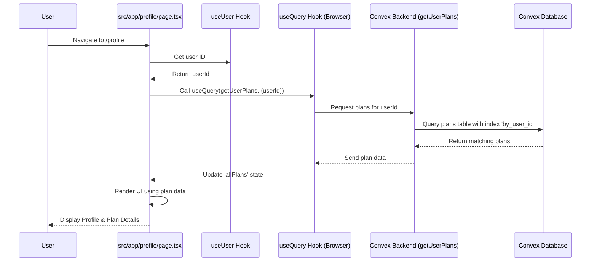

# Chapter 8: Profile Page & Plan Display

Welcome to the final chapter! In [Chapter 7: AI Fitness Plan Generation](07_ai_fitness_plan_generation_.md), we saw the exciting process of how the AI creates personalized workout and diet plans and saves them using our Convex backend. That's great, but where do you actually *see* these plans after they're made? How can you review your workout schedule or check your meal suggestions?

That's what the **Profile Page** is for! It's your personal command center within the Hevy Gym Trainer App.

**Our Goal:** Understand how the Profile Page fetches your fitness plans from the backend and displays them clearly, allowing you to review details, switch between different plans you might have, and even remove old ones.

## What Problem Does This Solve?

Imagine you generated a fantastic "Muscle Gain" plan last week, and today you created a new "Cardio Boost" plan. You need a place where:

1.  You can see *all* the plans saved under your account.
2.  You can easily select and view the details of a specific plan (workout exercises, diet meals).
3.  You can delete plans you no longer need.

Without a dedicated profile area, your carefully crafted plans would be lost or disorganized. The Profile Page acts as your personal folder for all your fitness blueprints.

**Use Case:** How does the app show your specific workout schedule and diet details when you visit the `/profile` page?

## Meet Your Dashboard: The Profile Page

Think of the Profile Page as your personal dashboard or digital binder in the app. It combines several concepts we've already learned about:

1.  **Identifying You (`useUser` from Clerk):** The page first needs to know *who* is visiting. It uses the `useUser` hook from [Chapter 2: Clerk User Management](02_clerk_user_management_.md) to get your unique user ID.
2.  **Fetching Your Plans (`useQuery` from Convex):** Knowing who you are, the page then asks the [Chapter 4: Convex Backend & Data](04_convex_backend___data__.md) for all plans associated with your user ID. It uses the `useQuery` hook to call the `getUserPlans` query function we defined in Convex.
3.  **Storing and Selecting Plans (React `useState`):** The page receives the list of your plans from Convex. It uses React's `useState` hook to keep track of all your plans and which specific plan you currently want to look at.
4.  **Displaying the Details (UI Components):** The page uses components from our [Chapter 3: UI Component System (Shadcn UI & Tailwind)](03_ui_component_system__shadcn_ui___tailwind__.md), like `<Tabs>` to switch between Workout and Diet views, and `<Accordion>` to neatly show exercises for each day, to present the selected plan's information clearly.
5.  **Deleting Plans (`useMutation` from Convex):** If you want to remove a plan, a button click triggers a `useMutation` hook, calling the `deleteUserPlan` mutation in Convex to remove it from the database.

## How It Works: Displaying Your Plan

Let's look at how the `src/app/profile/page.tsx` component brings this all together.

**1. Getting User Info and Fetching Plans:**

```typescript
// src/app/profile/page.tsx (Simplified Setup)
"use client";

import { useUser } from "@clerk/nextjs"; // 1. Get user info hook
import { useQuery, useMutation } from "convex/react"; // 2. Convex hooks
import { api } from "../../../convex/_generated/api"; // 3. API routes for Convex functions
import { useEffect, useState } from "react"; // 4. React hooks for state
// ... import UI components like Button, Tabs, Accordion ...

const ProfilePage = () => {
  const { user } = useUser(); // Get current logged-in user details
  const userId = user?.id as string; // Extract the user ID

  // Fetch all plans for this user from Convex
  const allPlans = useQuery(api.plans.getUserPlans, userId ? { userId } : "skip");

  // State to track loading, selected plan, etc.
  const [isLoading, setIsLoading] = useState(true);
  const [selectedPlanId, setSelectedPlanId] = useState<null | string>(null);

  useEffect(() => {
    // Update loading state when plans are fetched
    setIsLoading(allPlans === undefined);
    // If a plan ID isn't explicitly selected, default to the active one
    if (!selectedPlanId && allPlans) {
       const active = allPlans.find(p => p.isActive);
       if (active) setSelectedPlanId(active._id);
    }
  }, [allPlans, selectedPlanId]); // Re-run when plans or selection change

  // Find the plan to display (either selected or the default active one)
  const currentPlan = allPlans?.find((plan) => plan._id === selectedPlanId);

  // ... rest of the component (rendering, deletion logic) ...
};
```

*   **Explanation:**
    1.  We import necessary hooks from Clerk, Convex, and React.
    2.  `useUser()` gets the `user` object from Clerk. We extract the `userId`.
    3.  `useQuery(api.plans.getUserPlans, { userId })` calls our backend query. It passes the `userId` so Convex knows whose plans to fetch. We add a condition `userId ? { userId } : "skip"` to prevent running the query until the `userId` is available. `allPlans` will contain the array of plan objects once loaded.
    4.  `useState` hooks are used to manage the loading state (`isLoading`) and which plan the user has selected (`selectedPlanId`).
    5.  An `useEffect` hook updates the loading state and sets a default selected plan (the active one) when the data arrives.
    6.  We determine the `currentPlan` to display based on the `selectedPlanId`.

**2. Displaying the Plan Details (Workout Tab):**

```typescript
// src/app/profile/page.tsx (Simplified Workout Display using Accordion)

// ... inside the return() JSX, within the <TabsContent value="workout"> ...

<Accordion type="multiple" className="space-y-4">
  {currentPlan?.workoutPlan.exercises.map((exerciseDay, index) => (
    <AccordionItem key={index} value={exerciseDay.day}>
      {/* Trigger shows the day and number of routines */}
      <AccordionTrigger>{exerciseDay.day}</AccordionTrigger>

      {/* Content shows the routines for that day */}
      <AccordionContent>
        {exerciseDay.routines.map((routine, routineIndex) => (
          <div key={routineIndex} className="routine-card"> {/* Styled card */}
            <h4>{routine.name}</h4>
            <div>
              <span>{routine.sets} SETS</span>
              <span>{routine.reps} REPS</span>
            </div>
            {routine.description && <p>{routine.description}</p>}
          </div>
        ))}
      </AccordionContent>
    </AccordionItem>
  ))}
</Accordion>
```

*   **Explanation:**
    *   We check if `currentPlan` exists.
    *   We map over the `exercises` array within the `currentPlan.workoutPlan`.
    *   For each `exerciseDay`, we render an `<AccordionItem>` from Shadcn UI.
    *   The `<AccordionTrigger>` displays the day (e.g., "Monday").
    *   The `<AccordionContent>` maps over the `routines` for that day and displays the details (name, sets, reps, description) inside styled `div` elements (cards).

**3. Switching Between Plans:**

```typescript
// src/app/profile/page.tsx (Simplified Plan Selector Buttons)

// ... inside the return() JSX, likely near the top ...

<div className="plan-selector">
  {allPlans?.map((plan) => (
    <Button
      key={plan._id}
      variant={selectedPlanId === plan._id ? "default" : "outline"} // Highlight selected
      onClick={() => setSelectedPlanId(plan._id)} // Update state on click
    >
      {plan.name} {plan.isActive && "(Active)"}
    </Button>
  ))}
</div>
```

*   **Explanation:**
    *   We map over the `allPlans` array fetched from Convex.
    *   For each `plan`, we render a `<Button>`.
    *   The button's `variant` changes based on whether its ID matches the `selectedPlanId` in our state, providing visual feedback.
    *   The `onClick` handler calls `setSelectedPlanId(plan._id)`, updating the state. This triggers a re-render, and the `currentPlan` variable will update, causing the details display (like the Accordion) to show the newly selected plan's data.

**4. Deleting a Plan:**

```typescript
// src/app/profile/page.tsx (Simplified Deletion Logic)

// ... inside the main component function ...
const deletePlanMutation = useMutation(api.plans.deleteUserPlan);

const handleDelete = async (planIdToDelete: string) => {
  if (confirm("Are you sure you want to delete this plan?")) {
    try {
      await deletePlanMutation({ planId: planIdToDelete });
      // Optionally, reset selection if the deleted plan was selected
      if (selectedPlanId === planIdToDelete) {
        setSelectedPlanId(null); // Go back to default (or select another)
      }
      // Note: useQuery will automatically update 'allPlans' after deletion!
    } catch (err) {
      console.error("Failed to delete plan:", err);
      alert("Could not delete the plan.");
    }
  }
};

// ... inside the plan selector map (example) ...
<Button /* ... other props ... */ >
  {plan.name}
  <button onClick={(e) => { e.stopPropagation(); handleDelete(plan._id); }}>
    ❌ {/* Simple delete icon/button */}
  </button>
</Button>
```

*   **Explanation:**
    1.  We get the `deletePlanMutation` function using `useMutation(api.plans.deleteUserPlan)`.
    2.  The `handleDelete` function shows a confirmation dialog.
    3.  If confirmed, it calls `deletePlanMutation({ planId: planIdToDelete })`, sending the ID of the plan to delete to the Convex backend.
    4.  We add `e.stopPropagation()` to the inner delete button's `onClick` to prevent the outer button's `onClick` (which selects the plan) from firing simultaneously.
    5.  **Real-time Update:** Because we fetched `allPlans` using `useQuery`, Convex automatically detects the deletion in the database and pushes an update to the frontend. The `allPlans` variable updates automatically, causing the list of buttons to re-render without the deleted plan.

## Under the Hood: The Data Flow

Let's trace the steps when you load your Profile page:

1.  **Navigation:** You navigate to `/profile`.
2.  **Page Load:** Next.js loads the `ProfilePage` component (`src/app/profile/page.tsx`).
3.  **Authentication Check:** Clerk middleware (from [Chapter 2: Clerk User Management](02_clerk_user_management_.md)) ensures you're logged in.
4.  **User ID:** The `useUser()` hook provides your Clerk `userId`.
5.  **Data Request:** The `useQuery(api.plans.getUserPlans, { userId })` hook sends a request via WebSocket to the [Chapter 4: Convex Backend & Data](04_convex_backend___data__.md).
6.  **Backend Query:** Convex executes the `getUserPlans` query function (`convex/plans.ts`).
7.  **Database Lookup:** The query efficiently finds plans matching your `userId` in the `plans` table (using the `by_user_id` index defined in [Chapter 5: Database Schema](05_database_schema_.md)).
8.  **Data Response:** Convex sends the array of plan objects back to the frontend via WebSocket.
9.  **State Update:** `useQuery` receives the data and updates the `allPlans` variable. The `useEffect` might set the `selectedPlanId`.
10. **Rendering:** React re-renders the `ProfilePage` component.
11. **UI Display:** The component uses the `currentPlan` data and UI components like `<ProfileHeader>`, `<Tabs>`, and `<Accordion>` (from [Chapter 3: UI Component System (Shadcn UI & Tailwind)](03_ui_component_system__shadcn_ui___tailwind__.md)) to display your information and plan details. If `allPlans` is empty or still loading, it might show a `<NoFitnessPlan />` component or a loading spinner.

Here's a simplified sequence diagram:



This seamless flow, connecting user authentication, data fetching, backend logic, database storage, and frontend UI rendering, creates the complete experience for managing and viewing your personal fitness plans.

## Conclusion

Congratulations! You've reached the end of the Hevy Gym Trainer App tutorial. In this chapter, we saw how the **Profile Page** acts as the user's personal dashboard. We learned how it uses `useUser` (Clerk) to identify the user, `useQuery` (Convex) to fetch their specific fitness plans, `useState` (React) to manage selection, and UI components like `<Tabs>` and `<Accordion>` (Shadcn UI/Tailwind) to display the workout and diet details clearly. We also saw how `useMutation` (Convex) allows users to delete old plans, with real-time updates reflecting the change automatically.

This page effectively ties together many of the concepts covered in previous chapters:

*   [Next.js Application Structure](01_next_js_application_structure_.md) (Page routing)
*   [Clerk User Management](02_clerk_user_management_.md) (Getting the user ID)
*   [UI Component System (Shadcn UI & Tailwind)](03_ui_component_system__shadcn_ui___tailwind__.md) (Displaying the data)
*   [Convex Backend & Data](04_convex_backend___data__.md) (Fetching and deleting data)
*   [Database Schema](05_database_schema_.md) (Structure of the plan data)
*   [AI Fitness Plan Generation](07_ai_fitness_plan_generation_.md) (The source of the plans being displayed)

You now have a solid understanding of how the core pieces of the Hevy Gym Trainer App work together, from user login to AI plan generation to displaying the results. We hope this journey has been insightful! Feel free to explore the codebase further and experiment with building your own features.

---

Generated by [AI Codebase Knowledge Builder](https://github.com/The-Pocket/Tutorial-Codebase-Knowledge)