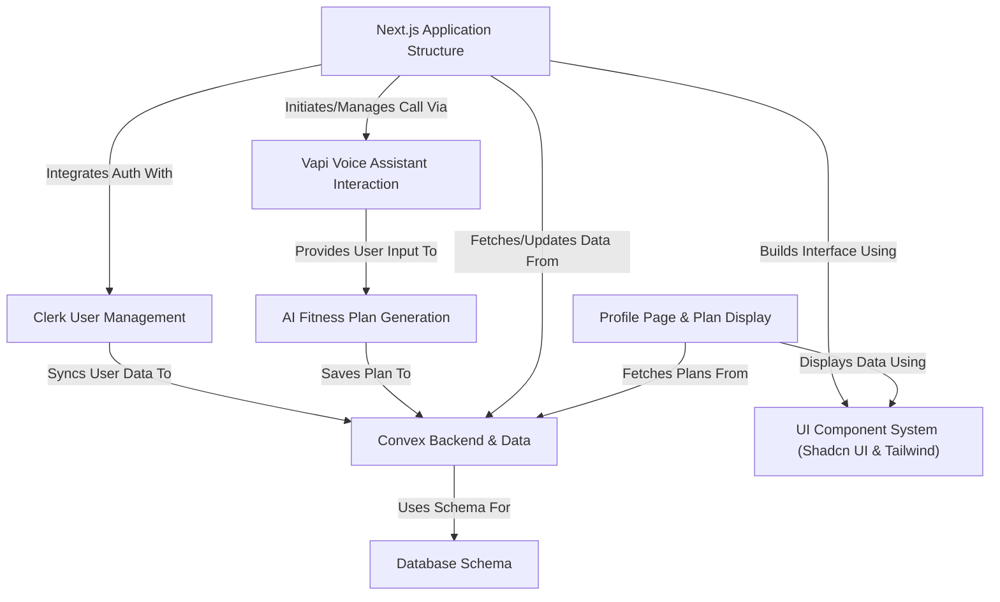

# Tutorial: Hevy-Gym-Trainer-App

This project is a **web application** called *Fitmax.ai* that helps users create personalized fitness plans.
Users can interact with an **AI assistant** via *voice chat* to provide their details (like age, goals, experience).
The AI then generates a custom **workout and diet plan**, which is saved and displayed on the user's profile page.
The application uses *Next.js* for the frontend, *Convex* for the backend and database, *Clerk* for user authentication, *Vapi* for the voice interface, and *Google Gemini* for the AI generation.

**Source Repository:** [https://github.com/AdarshThakare/Hevy-Gym-Trainer-App](https://github.com/AdarshThakare/Hevy-Gym-Trainer-App)

## Chapters

1. [Next.js Application Structure
](01_next_js_application_structure_.md)
2. [Clerk User Management
](02_clerk_user_management_.md)
3. [UI Component System (Shadcn UI & Tailwind)
](03_ui_component_system__shadcn_ui___tailwind__.md)
4. [Convex Backend & Data
](04_convex_backend___data_.md)
5. [Database Schema
](05_database_schema_.md)
6. [Vapi Voice Assistant Interaction
](06_vapi_voice_assistant_interaction_.md)
7. [AI Fitness Plan Generation
](07_ai_fitness_plan_generation_.md)
8. [Profile Page & Plan Display
](08_profile_page___plan_display_.md)

---

Generated by [AI Codebase Knowledge Builder](https://github.com/The-Pocket/Tutorial-Codebase-Knowledge)